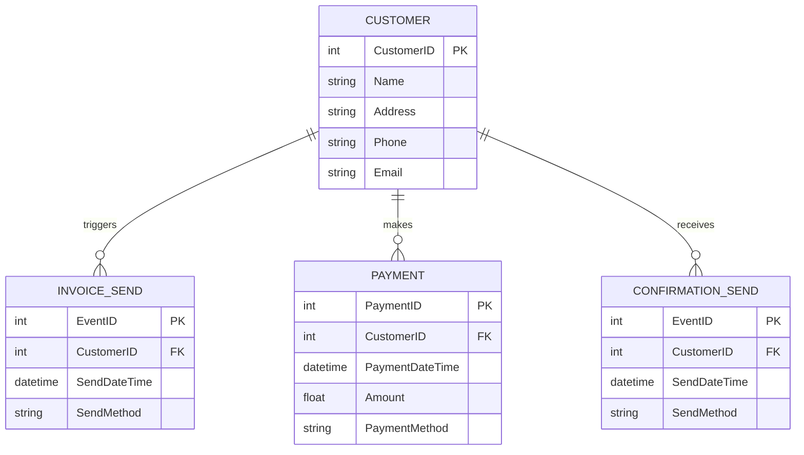

# Data Modeler Skill for Claude Code

Claude Code用のデータモデリング自動化Skillです。イミュータブルデータモデルの原則に基づき、ユースケース記述からRDBMSのテーブル設計を自動生成します。

## 特徴

- 🎯 **ブラックボードパターン採用**: 複数のKnowledge Sourceが協調して段階的にモデリング
- 📊 **イミュータブルデータモデル**: リソースとイベントの明確な分類
- 🔄 **段階的な処理**: エンティティ抽出 → 分類 → 関連分析 → ER図生成
- 📝 **Mermaid形式出力**: ER図を標準的な形式で生成
- 🇯🇵 **日本語対応**: 日本語のユースケース記述に対応

## アーキテクチャ

```
Blackboard Pattern
├── Blackboard (共有データ空間)
│   ├── state.yaml - フェーズ管理
│   ├── entities_raw.json - 抽出エンティティ
│   ├── entities_classified.json - 分類済みエンティティ
│   ├── model.json - データモデル
│   └── diagram.mmd - Mermaid ER図
│
├── Knowledge Sources (専門知識モジュール)
│   ├── entity-extractor - エンティティ抽出
│   ├── classifier - リソース/イベント分類
│   ├── relationship-analyzer - 関連分析
│   └── diagram-generator - ER図生成
│
└── Control Component (SKILL.md)
    └── 状態に応じて適切なKnowledge Sourceを呼び出す
```

## インストール

### 前提条件

- Claude Code がインストールされていること
- Python 3.9以上
- PyYAML（オプション: スタンドアロン実行時）

### Skillのインストール

```bash
# このディレクトリをClaude CodeのSkillsディレクトリにコピー
cp -r data-modeler-skill /mnt/skills/user/data-modeler
```

または、Claude Codeのユーザースキルディレクトリに配置してください。

## 使い方

### 基本的な使用方法

```bash
# ユースケースを直接指定
claude code --skill data-modeler "以下のユースケースに対してテーブル設計を行ってください：

請求期日が到来した場合、顧客に請求書を送付する。
期日までに入金がない場合には、確認状を送付する。"
```

### ファイルからの入力

```bash
# ユースケースをファイルに保存
cat > usecase.txt << 'EOF'
以下のユースケースに対して、RDBMSを前提としたテーブル設計をおこなってください。

## ユースケース:
「請求期日が到来した場合、顧客に請求書を送付する。期日までに入金がない場合には、確認状を送付する。」
EOF

# ファイルから実行
claude code --skill data-modeler "$(cat usecase.txt)"
```

### スタンドアロン実行（開発・テスト用）

各Knowledge Sourceは単独でも実行可能です。

```bash
# ブラックボードの初期化
mkdir -p /tmp/data-modeler-blackboard

cat > /tmp/data-modeler-blackboard/state.yaml << 'EOF'
current_phase: entity_extraction
input_usecase: "請求期日が到来した場合、顧客に請求書を送付する。期日までに入金がない場合には、確認状を送付する。"
completed_phases: []
next_action: entity-extractor
EOF

# 各フェーズを順次実行
python knowledge-sources/entity-extractor/extract.py
python knowledge-sources/classifier/classify.py
python knowledge-sources/relationship-analyzer/analyze.py
python knowledge-sources/diagram-generator/generate.py

# 結果を確認
cat /tmp/data-modeler-blackboard/diagram.mmd
```

## 出力例

### 入力

```
請求期日が到来した場合、顧客に請求書を送付する。
期日までに入金がない場合には、確認状を送付する。
```

### 出力（Mermaid ER図）



## ディレクトリ構造

```
data-modeler-skill/
├── SKILL.md                          # メインSkill定義
├── README.md                          # このファイル
├── knowledge-sources/                 # Knowledge Sources
│   ├── entity-extractor/
│   │   ├── SKILL.md                  # エンティティ抽出Skill
│   │   └── extract.py                # 実行スクリプト
│   ├── classifier/
│   │   ├── SKILL.md                  # 分類Skill
│   │   └── classify.py               # 実行スクリプト
│   ├── relationship-analyzer/
│   │   ├── SKILL.md                  # 関連分析Skill
│   │   └── analyze.py                # 実行スクリプト
│   └── diagram-generator/
│       ├── SKILL.md                  # ER図生成Skill
│       └── generate.py               # 実行スクリプト
├── templates/                         # テンプレート・ルール定義
│   ├── immutable-model-rules.md      # イミュータブルモデル原則
│   └── naming-rules.yaml             # 命名規則
└── examples/                          # サンプルユースケース（作成予定）
    └── invoice-management.txt
```

## カスタマイズ方法

### 命名規則の変更

`templates/naming-rules.yaml`を編集して、プロジェクト固有の命名規則を設定できます。

```yaml
# カラムの命名規則
column_naming_style: "snake_case"  # または "PascalCase"

# 主キーのサフィックス
primary_key_suffix: "_id"  # → customer_id
```

### モデリングルールの追加

`templates/immutable-model-rules.md`を編集して、追加のモデリングルールを定義できます。

### Knowledge Sourceの追加

新しい分析ロジックを追加する場合：

1. `knowledge-sources/`に新しいディレクトリを作成
2. `SKILL.md`と実行スクリプトを配置
3. メインの`SKILL.md`で制御フローに組み込む

## トラブルシューティング

### エンティティ抽出が不十分

**原因**: ユースケース記述が抽象的すぎる

**対策**:
- 具体的な名詞・動詞を含める
- 業務の流れを時系列で記述
- 主語・目的語を明確にする

### イベントとリソースの分類が不適切

**原因**: 分類基準が不明確

**対策**:
- イベントには「〜した」「〜が発生した」という表現を使用
- リソースには「〜がある」「〜を管理する」という表現を使用

### 交差エンティティが不足

**原因**: 多対多の関係が明示されていない

**対策**:
- 「複数の〜」という表現を使用
- 例: 「学生は複数の講義を受講し、講義には複数の学生が参加する」

## 制約事項

- 現バージョンは日本語ユースケースのみ対応
- ER図はMermaid形式のみ出力
- DDL生成は今後のバージョンで対応予定

## 今後の拡張予定

- [ ] DDL（CREATE TABLE文）の自動生成
- [ ] サンプルデータ生成
- [ ] 既存データベースからのリバースエンジニアリング
- [ ] 複数のユースケースからの統合モデリング
- [ ] 検証機能の強化（整合性チェック）
- [ ] 英語ユースケースへの対応
- [ ] PNG/SVG形式でのER図出力

## 参考資料

- [イミュータブルデータモデル - Scrapbox](https://scrapbox.io/kawasima/イミュータブルデータモデル)
- LangChainとLangGraphによるRAG・AIエージェント実践入門 第12章
- [Mermaid ER Diagram Documentation](https://mermaid.js.org/syntax/entityRelationshipDiagram.html)

## ライセンス

MIT License

## 作者

Akira Abe

## 貢献

プルリクエスト、Issue、フィードバックを歓迎します！

## 変更履歴

### v1.0.0 (2025-01-XX)
- 初回リリース
- ブラックボードパターン実装
- 4つのKnowledge Source実装
- Mermaid ER図生成機能
