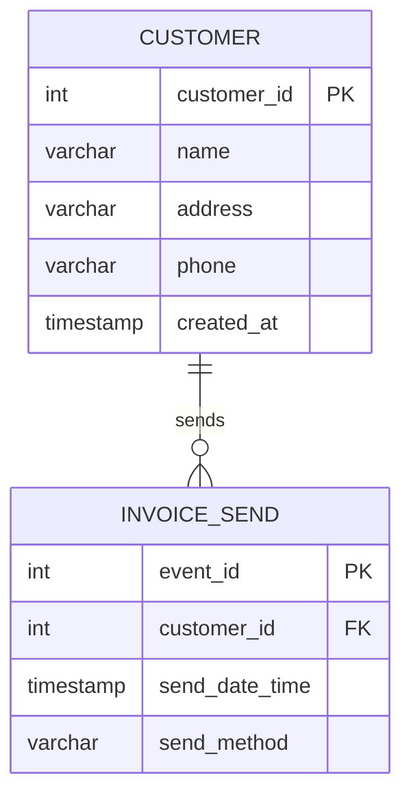

# Data Modeler Skill

このSkillは、ユースケース記述からRDBMSのテーブル設計を自動生成するエージェントです。
**ブラックボードパターン**を採用し、Claude自身が段階的にデータモデリングを実行します。

## アーキテクチャ概要

### ブラックボードパターン

このSkillは**ブラックボードパターン**を採用しています。ブラックボードとは、複数の専門知識（Knowledge Sources）が協調して問題を解決するための**共有データ空間**です。

```
┌─────────────────────────────────────────┐
│   Blackboard (共有データ空間)            │
│   artifacts/{project_name}/            │
├─────────────────────────────────────────┤
│ ├── state.yaml                         │ ← フェーズ管理・制御情報
│ ├── entities_raw.json                  │ ← 抽出された名詞・動詞
│ ├── entities_classified.json          │ ← リソース/イベント分類結果
│ ├── model.json                         │ ← データモデル定義（関連含む）
│ ├── validation_result.json            │ ← 検証結果
│ └── er_diagram.mmd                     │ ← 最終出力（Mermaid ER図）
└─────────────────────────────────────────┘
           ↑              ↑
           │ 読み書き      │
           │              │
┌──────────┴──────────────┴──────────────┐
│  Claude (Control Component)            │
│  各フェーズを順次実行                   │
├────────────────────────────────────────┤
│ Phase 1: エンティティ抽出               │
│ Phase 2: リソース/イベント分類          │
│ Phase 3: 関連分析                       │
│ Phase 4: 検証                           │
│ Phase 5: ER図生成                       │
└────────────────────────────────────────┘
```

**ブラックボードの役割:**
- **中間結果の保存**: 各フェーズの成果物を保存
- **フェーズ間の連携**: 前フェーズの出力が次フェーズの入力になる
- **状態管理**: 現在のフェーズ、完了済みフェーズを記録
- **検証可能性**: 各段階の成果物を後から確認できる
- **プロジェクト分離**: 複数のモデリングプロジェクトを並行管理可能

**プロジェクト名によるディレクトリ分離:**

各モデリングプロジェクトは独立したディレクトリで管理されます。

```
artifacts/
  ├── invoice-management/      ← 請求書管理システム
  │   ├── state.yaml
  │   ├── entities_classified.json
  │   ├── model.json
  │   └── ...
  ├── inventory-management/    ← 在庫管理システム
  │   ├── state.yaml
  │   └── ...
  └── order-processing/        ← 受注処理システム
      └── ...
```

これにより、異なる業務ドメインのモデリングを同時進行できます。

## 使用方法

### 基本的な使い方

```bash
# ユースケースからデータモデルを生成
/data-modeler

請求期日が到来した場合、顧客に請求書を送付する。
期日までに入金がない場合には、確認状を送付する。
```

### ファイルからの入力

```bash
# タスク記述をファイルから読み込む
cat examples/invoice-management.txt
# その後、/data-modeler を実行してユースケースを入力
```

## 実行フロー

### 全体フロー

```
1. プロジェクト名の入力 & ブラックボード初期化
   ↓ (artifacts/{project_name}/ ディレクトリを作成)
2. Phase 0.5: ユースケース詳細化 ★NEW
   ↓ (usecase_detailed.md をブラックボードに書き込み)
3. Phase 1: エンティティ抽出
   ↓ (entities_raw.json をブラックボードに書き込み)
4. Phase 2: リソース/イベント分類
   ↓ (entities_classified.json をブラックボードに書き込み)
5. Phase 2.5: 属性レビュー
   ↓ (entities_classified.json を更新)
6. Phase 3: 関連分析
   ↓ (model.json をブラックボードに書き込み)
7. Phase 4: 検証
   ↓ (validation_result.json をブラックボードに書き込み)
8. Phase 5: ER図生成
   ↓ (er_diagram.mmd をブラックボードに書き込み)
9. Phase 6: DDL生成
   ↓ (schema.sql, sample_data.sql, query_examples.sql をブラックボードに書き込み)
10. Phase 7: OpenAPI生成 ★NEW
    ↓ (openapi.yaml をブラックボードに書き込み)
11. 最終結果を表示
```

**重要:** すべてのブラックボードファイル（`state.yaml`, `entities_raw.json`, `model.json` など）は、プロジェクトごとに独立した `artifacts/{project_name}/` ディレクトリ内に保存されます。

---

## Phase 0.5: ユースケース詳細化

### 目的
漠然とした要求メモから作成されたユースケースを、API設計に十分な詳細レベルに引き上げます。
AIが推定した基本的なユースケースを叩き台として、ユーザーの業務知識を反映させることでモデル精度を向上させます。

### ブラックボードからの入力
- `usecase.md`（Phase 0で生成された基本的なユースケース）
- `state.yaml` の `project_name` フィールド

### 処理内容

このフェーズは `/usecase-detailer` スキルを使用して実行します。

**詳細化する要素:**

1. **CRUD操作の補完**
   - Create: どのエンティティをどのタイミングで作成？
   - Read: どの検索条件・フィルター・ソートが必要？
   - Update: どの属性を変更可能？誰が変更可能？
   - Delete: 論理削除？物理削除？削除条件は？

2. **エラーケースの定義**
   - バリデーションエラー（必須項目、型、範囲）
   - ビジネスルール違反（重複、権限、状態遷移）
   - 外部依存エラー（DB接続、外部API）

3. **検証ルールの抽出**
   - 必須項目の明確化
   - 値の範囲・形式制約
   - 一意性制約
   - 関連性制約（外部キー、状態遷移）

4. **APIマッピング**
   - HTTPメソッド（GET/POST/PUT/DELETE）
   - エンドポイント案
   - リクエスト/レスポンス形式

**対話的詳細化:**

各ユースケースに対して、以下の質問を対話的に行います：
- 「このユースケースでは、どのエンティティを作成/更新しますか？」
- 「顧客を選択する際、どんな検索条件が必要ですか？」
- 「プロジェクト名に制約はありますか？」
- 「登録が失敗するのはどんな場合ですか？」

**実行方法:**

```bash
/usecase-detailer {project_name}
```

このコマンドにより、`usecase.md` を読み込み、対話的に詳細化を行い、`usecase_detailed.md` を生成します。

### ブラックボードへの出力

`usecase_detailed.md` に以下の形式で書き込み:

```markdown
# ユースケース詳細仕様

## UC-01: プロジェクト登録

### 基本フロー
1. **顧客選択**
   - 検索条件: 顧客名（部分一致）、業界
   - ソート: 顧客名昇順
   - エラー: 顧客が存在しない場合 → 404 Customer Not Found

2. **プロジェクト情報入力**
   - 必須項目: プロジェクト名、予定開始日、契約金額
   - 任意項目: 説明、開発種別
   - バリデーション:
     - プロジェクト名: 1-200文字
     - 契約金額: 0以上
     - 予定開始日: 今日以降

3. **登録実行**
   - Create: PROJECT レコード
   - 重複チェック: 同一顧客×同一プロジェクト名 → 409 Conflict
   - レスポンス: 201 Created + project_id

### API マッピング
- エンドポイント: POST /api/projects
- Request Body: { customer_id, project_name, planned_start_date, contract_amount, description?, developmentTypeID? }
- Success: 201 Created
- Errors: 400 (バリデーション), 404 (顧客不存在), 409 (重複)
```

### 次フェーズへの遷移

`state.yaml` を更新:
```yaml
current_phase: entity_extraction
completed_phases:
  - usecase_detailing
```

**スキップ判断:**

- 詳細化が必要: ユースケースが抽象的（検索条件・エラーケース未定義）→ Phase 0.5を実行
- スキップ可能: ユースケースが既に詳細（API設計に十分な情報）→ Phase 1へ直接進む

詳細な実装は `/usecase-detailer` スキルを参照してください。

---

## Phase 1: エンティティ抽出

### 目的
ユースケース記述から、データモデリングに必要な**名詞（エンティティ候補）**と**動詞（イベント候補）**を抽出します。

### ブラックボードからの入力
- `state.yaml` の `input_usecase` フィールド（ユーザーが入力したユースケース記述）

### 処理内容

以下の基準でエンティティ候補を抽出してください：

**名詞の抽出:**
- 人、物、組織、概念を表す名詞
- データとして管理すべき対象
- 抽象的すぎる概念（「システム」「データ」「情報」など）は除外

**動詞の抽出:**
- 業務アクションを示す動詞
- 特定の時点で発生する行為
- 「〜する」「〜される」という形式

**命名規則:**
- 名詞: PascalCase、単数形（例: `Customer`, `Invoice`）
- 動詞: camelCase（例: `send`, `confirm`）
- 詳細は `templates/naming-rules.md` を参照

### ブラックボードへの出力

`entities_raw.json` に以下の形式で書き込み:

```json
{
  "noun_candidates": [
    {
      "japanese": "顧客",
      "english": "Customer",
      "note": "請求書を受け取る対象"
    },
    {
      "japanese": "請求書",
      "english": "Invoice",
      "note": "顧客に送付される文書"
    }
  ],
  "verb_candidates": [
    {
      "japanese": "送付する",
      "english": "send",
      "note": "請求書や確認状を送る行為"
    }
  ]
}
```

### 次フェーズへの遷移

`state.yaml` を更新:
```yaml
current_phase: classification
completed_phases:
  - entity_extraction
```

---

## Phase 2: リソース/イベント分類

### 目的
抽出されたエンティティ候補を、**リソース**と**イベント**に分類します。
これはイミュータブルデータモデルの基本原則です。

### ブラックボードからの入力
- `entities_raw.json`

### 処理内容

**分類基準:**

**リソース（Resource）:**
- 継続的に存在するもの
- 時間経過で状態が変化しうるもの
- 「〜がある」「〜を管理する」という表現で説明できる
- 例: 顧客、商品、社員、部署

**イベント（Event）:**
- 特定時点で発生した事実
- 一度発生したら変更されないもの（不変）
- 「〜した」「〜が発生した」という表現で説明できる
- **必ず1つの日時属性を持つ**（最重要）
- 例: 注文、入金、出荷、請求書送付

**イベント命名の推奨形式:**
- 動詞 + 名詞: `InvoiceSend`（請求書送付）、`PaymentMake`（入金）
- 詳細は `templates/naming-rules.md` を参照

**参考資料:**
- `templates/immutable-model-rules.md` の「エンティティの分類」セクション

### ブラックボードへの出力

`entities_classified.json` に以下の形式で書き込み:

```json
{
  "resources": [
    {
      "japanese": "顧客",
      "english": "Customer",
      "attributes": [
        {
          "japanese": "顧客ID",
          "english": "customer_id",
          "type": "INT",
          "is_primary_key": true
        },
        {
          "japanese": "顧客名",
          "english": "Name",
          "type": "VARCHAR(100)",
          "is_primary_key": false
        }
      ],
      "note": "請求書を受け取る主体"
    }
  ],
  "events": [
    {
      "japanese": "請求書送付",
      "english": "InvoiceSend",
      "datetime_attribute": {
        "japanese": "送付日時",
        "english": "send_date_time",
        "type": "TIMESTAMP"
      },
      "attributes": [
        {
          "japanese": "イベントID",
          "english": "event_id",
          "type": "INT",
          "is_primary_key": true
        },
        {
          "japanese": "送付日時",
          "english": "send_date_time",
          "type": "TIMESTAMP",
          "is_primary_key": false
        },
        {
          "japanese": "送付方法",
          "english": "send_method",
          "type": "VARCHAR(50)",
          "is_primary_key": false
        }
      ],
      "note": "顧客に請求書を送付した事実"
    }
  ]
}
```

### 次フェーズへの遷移

`state.yaml` を更新:
```yaml
current_phase: relationship_analysis
completed_phases:
  - entity_extraction
  - classification
```

---

## Phase 2.5: 属性レビュー＆編集

### 目的
Phase 2で自動推定された属性をユーザーに提示し、対話的に確認・修正できるようにします。
AIが推定した属性を叩き台として、ユーザーの業務知識を反映させることでモデル精度を向上させます。

### ブラックボードからの入力
- `entities_classified.json`（Phase 2で生成された分類済みエンティティ）

### 処理内容

#### ステップ1: 属性一覧の表示

全エンティティの属性をMarkdown表形式で表示します。

**表示形式:**

```markdown
# 属性レビュー

以下の属性が自動推定されました。内容を確認し、必要に応じて修正してください。

## リソース

### Customer（顧客）

| 属性名（日本語） | 属性名（英語） | 型 | 主キー | 備考 |
|---------------|--------------|-----|--------|------|
| 顧客ID | customer_id | INT | ✓ | |
| 顧客名 | name | VARCHAR(100) | | |
| 住所 | address | VARCHAR(255) | | |
| 電話番号 | phone | VARCHAR(20) | | |
| 作成日時 | created_at | TIMESTAMP | | |

**説明**: 請求書を受け取る主体。継続的に存在し管理される

---

### Invoice（請求書）

| 属性名（日本語） | 属性名（英語） | 型 | 主キー | 備考 |
|---------------|--------------|-----|--------|------|
| 請求書ID | invoice_id | INT | ✓ | |
| 顧客ID | customer_id | INT | | 外部キー |
| 請求番号 | invoice_number | VARCHAR(50) | | |
| 発行日 | issue_date | DATE | | |
| 請求金額 | amount | DECIMAL(10,2) | | |
| 支払期日 | due_date | DATE | | |

**説明**: 発行された請求文書。顧客に対する請求内容を保持

---

## イベント

### InvoiceSend（請求書送付）

**日時属性**: 送付日時（send_date_time）- TIMESTAMP

| 属性名（日本語） | 属性名（英語） | 型 | 主キー | 備考 |
|---------------|--------------|-----|--------|------|
| イベントID | event_id | INT | ✓ | |
| 請求書ID | invoice_id | INT | | 外部キー |
| 顧客ID | customer_id | INT | | 外部キー |
| 送付日時 | send_date_time | TIMESTAMP | | **日時属性** |
| 送付方法 | send_method | VARCHAR(50) | | |

**説明**: 請求書を顧客に送付した事実。特定時点で発生した不変のイベント
```

#### ステップ2: メインメニュー

ユーザーに以下のメニューを提示します：

```
このまま次のフェーズ（関連分析）に進みますか?

1. 既存エンティティの属性を修正する
2. 新しいエンティティを追加する
3. エンティティを削除する
4. このまま進む

番号を入力してください:
```

**選択肢の説明:**
- **選択肢1**: 既存エンティティの属性を追加・削除・修正（従来の属性修正フロー）
- **選択肢2**: 新しいリソースまたはイベントエンティティを追加
- **選択肢3**: 既存エンティティを削除（外部キー参照チェックあり）
- **選択肢4**: 現在のモデルを確定し、Phase 3（関連分析）に進む

#### ステップ3: 既存エンティティの属性修正フロー（選択肢1）

ユーザーが「1. 既存エンティティの属性を修正する」を選択した場合、以下の対話的な修正フローを実行します。

##### 3-1. エンティティ選択

```
どのエンティティを修正しますか？

【リソース】
1. Customer（顧客）
2. Invoice（請求書）

【イベント】
3. InvoiceSend（請求書送付）
4. Payment（入金）
5. ConfirmationSend（確認状送付）

番号を入力してください（終了する場合は 0）:
```

##### 3-2. 修正操作選択

```
Customer（顧客）の属性をどう修正しますか？

1. 属性を追加する
2. 属性を削除する
3. 属性を修正する
4. 戻る

番号を入力してください:
```

##### 3-3. 属性の追加

```
新しい属性を追加します。以下の情報を入力してください。

属性名（日本語）:
属性名（英語）:
型（例: INT, VARCHAR(100), DECIMAL(10,2), TIMESTAMP, DATE）:
主キーにしますか？（y/n）:

[入力後]
以下の属性を追加します:
- 属性名（日本語）: メールアドレス
- 属性名（英語）: Email
- 型: VARCHAR(100)
- 主キー: いいえ

追加してよろしいですか？（y/n）:
```

**検証ルール:**
- 主キーは1エンティティに1つのみ（既存の主キーがある場合は警告）
- 英語名はPascalCase推奨、型は有効なSQL型
- イベントエンティティの場合、日時属性（TIMESTAMP型）の重複追加を警告

##### 3-4. 属性の削除

```
削除する属性を選択してください:

1. 顧客ID (customer_id) - INT - 主キー
2. 顧客名 (name) - VARCHAR(100)
3. 住所 (address) - VARCHAR(255)
4. 電話番号 (phone) - VARCHAR(20)
5. 作成日時 (created_at) - TIMESTAMP

番号を入力してください:
```

**検証ルール:**
- 主キーは削除不可（エラーメッセージを表示）
- イベントの日時属性（datetime_attribute）は削除不可
- 外部キーの可能性がある属性は警告（`{エンティティ名}ID`形式）

**エラーメッセージ例:**

```
[エラー] 主キーは削除できません。

理由: すべてのエンティティには必ず1つの主キーが必要です。
現在の主キー: customer_id

対処方法:
1. 別の属性を主キーに設定する
2. その後、現在の主キーを削除する
```

```
[エラー] イベントの日時属性は削除できません。

理由: イベントエンティティは必ず1つの日時属性を持つ必要があります。
      これはイミュータブルデータモデルの基本原則です。

現在の日時属性: send_date_time (TIMESTAMP)

参考: templates/immutable-model-rules.md の「イベントの日時属性に関するルール」
```

##### 3-5. 属性の修正

```
修正する属性を選択してください:

1. 顧客ID (customer_id) - INT - 主キー
2. 顧客名 (name) - VARCHAR(100)
3. 住所 (address) - VARCHAR(255)
4. 電話番号 (phone) - VARCHAR(20)
5. 作成日時 (created_at) - TIMESTAMP

番号を入力してください:

[選択後]
修正する項目を選択してください:

1. 属性名（日本語）
2. 属性名（英語）
3. 型
4. 主キーフラグ

番号を入力してください:

[選択後]
現在の値: VARCHAR(100)
新しい値: VARCHAR(255)

[入力後]
以下のように修正します:
- 顧客名 (name): VARCHAR(100) → VARCHAR(255)

修正してよろしいですか？（y/n）:
```

**検証ルール:**
- 主キーを外す場合、他に主キーがあることを確認
- イベントの日時属性名を変更する場合、`datetime_attribute`と`attributes`の両方を更新

##### 3-6. 変更後の再表示

```
修正が完了しました。更新後の属性を確認してください。

### Customer（顧客）

| 属性名（日本語） | 属性名（英語） | 型 | 主キー | 備考 |
|---------------|--------------|-----|--------|------|
| 顧客ID | customer_id | INT | ✓ | |
| 顧客名 | name | VARCHAR(255) | | ← 修正 |
| 住所 | address | VARCHAR(255) | | |
| 電話番号 | phone | VARCHAR(20) | | |
| メールアドレス | Email | VARCHAR(100) | | ← 追加 |
| 作成日時 | created_at | TIMESTAMP | | |

引き続き他のエンティティを修正しますか？（y/n）:
```

#### ステップ3.1: エンティティ追加フロー（選択肢2）

ユーザーが「2. 新しいエンティティを追加する」を選択した場合、以下のフローを実行します。

##### 3.1-1. エンティティ種別の選択

```
どの種類のエンティティを追加しますか?

1. リソース（Resource）- 継続的に存在するもの
   例: 顧客、商品、従業員、部署、業界、開発種別
2. イベント（Event）- 特定時点で発生した事実
   例: 注文、入金、出荷、評価、リスク評価、プロジェクト開始

番号を入力してください:
```

**エンティティ種別の説明:**
- **リソース**: システムで管理する対象物。継続的に存在し、状態が変化する可能性がある
- **イベント**: 特定の時点で発生した事実。一度発生したら不変（イミュータブル）

##### 3.1-2. リソースエンティティの追加

ユーザーが「1. リソース」を選択した場合：

```
=== リソースエンティティの追加 ===

エンティティ名（日本語）:
> 開発種別

エンティティ名（英語）:
> DevelopmentType

説明（note）:
> 開発種別のマスターデータ（新規開発、保守開発など）

[確認画面]
以下のリソースエンティティを追加します:
- 日本語名: 開発種別
- 英語名: DevelopmentType
- 説明: 開発種別のマスターデータ（新規開発、保守開発など）

自動生成される属性（★自動生成）:
  1. development_type_id (INT, 主キー) ★
  2. development_type_name (VARCHAR(100)) ★
  3. created_at (TIMESTAMP) ★

追加の属性を定義しますか？（y/n）:
```

**自動生成ルール:**
1. **主キー**: `{EntityName}ID` (INT, 主キー)
2. **name属性**: `{entity_name}_name` (VARCHAR(100))
3. **作成日時**: `created_at` (TIMESTAMP)

**追加属性の定義（yを選択した場合）:**

```
[属性追加ループ - 既存の3-3. 属性の追加フローを再利用]

属性名（日本語）:
> 説明

属性名（英語）:
> description

型（例: INT, VARCHAR(100), TEXT, TIMESTAMP）:
> TEXT

主キーにしますか？（y/n）:
> n

もう1つ属性を追加しますか？（y/n）:
> n
```

**最終確認:**

```
以下の内容でリソースエンティティを追加します:

### DevelopmentType（開発種別）

| 属性名（日本語） | 属性名（英語） | 型 | 主キー | 自動生成 |
|---------------|--------------|-----|--------|---------|
| 開発種別ID | development_type_id | INT | ✓ | ★ |
| 開発種別名 | development_type_name | VARCHAR(100) | | ★ |
| 説明 | description | TEXT | | |
| 作成日時 | created_at | TIMESTAMP | | ★ |

**説明**: 開発種別のマスターデータ（新規開発、保守開発など）

この内容で追加してよろしいですか？（y/n）:
> y

✅ DevelopmentType エンティティを追加しました。
```

##### 3.1-3. イベントエンティティの追加

ユーザーが「2. イベント」を選択した場合：

```
=== イベントエンティティの追加 ===

イベント名（日本語）:
> プロジェクト開始

イベント名（英語）:
> ProjectStart

説明（note）:
> プロジェクトが正式に発足した事実

[日時属性の定義 - イベント特有]
イベントには必ず1つの日時属性が必要です。

日時属性名（日本語）:
> 開始日時

日時属性名（英語）:
> start_date_time

[確認画面]
以下のイベントエンティティを追加します:
- 日本語名: プロジェクト開始
- 英語名: ProjectStart
- 説明: プロジェクトが正式に発足した事実
- 日時属性: start_date_time (TIMESTAMP)

自動生成される属性（★自動生成）:
  1. event_id (INT, 主キー) ★
  2. start_date_time (TIMESTAMP) ← 日時属性

追加の属性を定義しますか？（y/n）:
```

**自動生成ルール（イベント）:**
1. **主キー**: `event_id` (INT, 主キー) - イベントは汎用的なevent_idを使用
2. **日時属性**: ユーザー指定の名前 (TIMESTAMP)

**追加属性の定義（yを選択した場合）:**

```
[属性追加ループ]

属性名（日本語）:
> プロジェクトID

属性名（英語）:
> project_id

型:
> INT

主キーにしますか？（y/n）:
> n

もう1つ属性を追加しますか？（y/n）:
> y

属性名（日本語）:
> 登録者

属性名（英語）:
> registered_by

型:
> INT

主キーにしますか？（y/n）:
> n

もう1つ属性を追加しますか？（y/n）:
> n
```

**最終確認:**

```
以下の内容でイベントエンティティを追加します:

### ProjectStart（プロジェクト開始）
**日時属性**: start_date_time (TIMESTAMP)

| 属性名（日本語） | 属性名（英語） | 型 | 主キー | 自動生成 |
|---------------|--------------|-----|--------|---------|
| イベントID | event_id | INT | ✓ | ★ |
| プロジェクトID | project_id | INT | | |
| 開始日時 | start_date_time | TIMESTAMP | | (日時属性) |
| 登録者 | registered_by | INT | | |

**説明**: プロジェクトが正式に発足した事実

この内容で追加してよろしいですか？（y/n）:
> y

✅ ProjectStart イベントエンティティを追加しました。
```

##### 3.1-4. 検証ルール（エンティティ追加時）

**1. 命名規則チェック:**
- 英語名: PascalCase、単数形、特殊文字なし
- 日本語名: 空でない、わかりやすい名称
- 重複チェック: 既存のエンティティ名と被っていないか

**エラーメッセージ例:**
```
[エラー] エンティティ名が既に存在します: "Customer"

既存のエンティティ:
  - Customer（顧客） - リソース

別の名前を入力してください:
```

**2. イベント特有チェック:**
- 日時属性必須（TIMESTAMP型）
- `datetime_attribute` と `attributes` 両方に含める

**3. リソース特有チェック:**
- 主キー必須（{EntityName}ID）
- Name属性は推奨（自動生成で含まれる）

##### 3.1-5. entities_classified.json への追加

追加したエンティティを `entities_classified.json` に書き込みます。

**リソースの場合:**
```json
{
  "resources": [
    {
      "japanese": "開発種別",
      "english": "DevelopmentType",
      "attributes": [
        {
          "japanese": "開発種別ID",
          "english": "development_type_id",
          "type": "INT",
          "is_primary_key": true
        },
        {
          "japanese": "開発種別名",
          "english": "development_type_name",
          "type": "VARCHAR(100)",
          "is_primary_key": false
        },
        {
          "japanese": "説明",
          "english": "description",
          "type": "TEXT",
          "is_primary_key": false
        },
        {
          "japanese": "作成日時",
          "english": "created_at",
          "type": "TIMESTAMP",
          "is_primary_key": false
        }
      ],
      "note": "開発種別のマスターデータ（新規開発、保守開発など）"
    }
  ]
}
```

**イベントの場合:**
```json
{
  "events": [
    {
      "japanese": "プロジェクト開始",
      "english": "ProjectStart",
      "datetime_attribute": {
        "japanese": "開始日時",
        "english": "start_date_time",
        "type": "TIMESTAMP"
      },
      "attributes": [
        {
          "japanese": "イベントID",
          "english": "event_id",
          "type": "INT",
          "is_primary_key": true
        },
        {
          "japanese": "プロジェクトID",
          "english": "project_id",
          "type": "INT",
          "is_primary_key": false
        },
        {
          "japanese": "開始日時",
          "english": "start_date_time",
          "type": "TIMESTAMP",
          "is_primary_key": false
        },
        {
          "japanese": "登録者",
          "english": "registered_by",
          "type": "INT",
          "is_primary_key": false
        }
      ],
      "note": "プロジェクトが正式に発足した事実"
    }
  ]
}
```

#### ステップ3.2: エンティティ削除フロー（選択肢3）

ユーザーが「3. エンティティを削除する」を選択した場合、以下のフローを実行します。

##### 3.2-1. エンティティ選択

```
=== エンティティの削除 ===

削除するエンティティを選択してください:

【リソース】
1. Project（プロジェクト）
2. Customer（顧客）
3. DevelopmentType（開発種別）
4. Industry（業界）

【イベント】
5. ProjectStart（プロジェクト開始）
6. RiskEvaluate（リスク評価）
7. InvoiceSend（請求書送付）

番号を入力してください（キャンセルは 0）:
```

##### 3.2-2. 外部キー参照チェック

選択されたエンティティが他のエンティティから参照されているかをチェックします。

**検出ロジック:**
全エンティティをスキャンして `{EntityName}ID` 属性を検索します。

**例: DevelopmentType を削除しようとした場合:**

```
[外部キー参照チェック実行中...]

以下のエンティティに "development_type_id" 属性が見つかりました:
- Project（プロジェクト）
- PROJECT_DEVELOPMENT_TYPE（ジャンクションテーブル）
```

##### 3.2-3. 削除確認

```
以下のエンティティを削除しようとしています:
- 日本語名: 開発種別
- 英語名: DevelopmentType
- 種類: リソース

【警告】この操作は取り消せません。

このエンティティは他のエンティティから参照されている可能性があります:
- Project エンティティに development_type_id 属性があります
- PROJECT_DEVELOPMENT_TYPE エンティティに development_type_id 属性があります

削除すると、Phase 3（関連分析）でこの関係が失われます。
また、Phase 6（DDL生成）で外部キー制約エラーが発生する可能性があります。

本当に削除してよろしいですか？（yes と完全に入力してください）:
```

**検証ルール:**
- 単純な `y` や `yes` 以外の完全入力を要求
- 大文字小文字を区別（`yes` のみ受け付ける）

**削除実行:**

```
> yes

✅ DevelopmentType エンティティを削除しました。
entities_classified.json から削除されました。

引き続き他のエンティティを削除しますか？（y/n）:
> n

メインメニューに戻ります。
```

**キャンセル:**

```
> no

削除をキャンセルしました。
メインメニューに戻ります。
```

##### 3.2-4. entities_classified.json からの削除

削除したエンティティを `entities_classified.json` から除外します。

**削除前:**
```json
{
  "resources": [
    {"english": "Project", ...},
    {"english": "Customer", ...},
    {"english": "DevelopmentType", ...}  ← 削除対象
  ]
}
```

**削除後:**
```json
{
  "resources": [
    {"english": "Project", ...},
    {"english": "Customer", ...}
  ]
}
```

#### ステップ4: イベントエンティティの特殊処理

イベントエンティティの修正時は、以下の特殊なルールを適用します。

**datetime_attributeの整合性維持:**

```json
// entities_classified.jsonの構造
{
  "events": [
    {
      "datetime_attribute": {
        "japanese": "送付日時",
        "english": "send_date_time",
        "type": "TIMESTAMP"
      },
      "attributes": [
        {
          "japanese": "送付日時",  // ← datetime_attributeと重複
          "english": "send_date_time",
          "type": "TIMESTAMP"
        }
      ]
    }
  ]
}
```

**処理ルール:**
1. `datetime_attribute`の修正時、`attributes`内の対応する属性も同時に更新
2. `attributes`内の日時属性を修正する場合、`datetime_attribute`も更新
3. 日時属性は削除不可（警告メッセージを表示）
4. イベントに日時属性は1つのみ（追加時に検証）

**警告メッセージ例:**

```
[警告] イベントには既に日時属性「send_date_time」があります。
イベントには1つの日時属性のみを持たせる必要があります。
複数の日時が必要な場合は、イベントを分割してください。

参考: templates/immutable-model-rules.md の「イベントの日時属性に関するルール」
```

#### ステップ5: 最終確認と保存

```
すべての修正が完了しました。

【変更サマリー】
- Customer（顧客）: 1件の属性を修正、1件の属性を追加
- Invoice（請求書）: 変更なし
- InvoiceSend（請求書送付）: 変更なし

この内容で確定してよろしいですか？（y/n）:

[yを選択した場合]
entities_classified.json を更新しました。
次のフェーズ（関連分析）に進みます。
```

### ブラックボードへの出力

修正後の内容で `entities_classified.json` を上書き保存します。

**変更検出:**
- 変更がない場合: そのまま次フェーズへ
- 変更がある場合: ファイルを上書き後、次フェーズへ

### 次フェーズへの遷移

`state.yaml` を更新:
```yaml
current_phase: relationship_analysis
completed_phases:
  - entity_extraction
  - classification
  - attribute_review  # ← 新規追加
```

### エラーハンドリング

#### 型の妥当性チェック

**サポートする型:**
```
【整数型】
  INT, INTEGER, BIGINT, SMALLINT, TINYINT

【文字列型】
  VARCHAR(n) - 可変長文字列（例: VARCHAR(100)）
  CHAR(n) - 固定長文字列（例: CHAR(10)）
  TEXT - 長文テキスト

【数値型】
  DECIMAL(m,n) - 固定小数点（例: DECIMAL(10,2)）
  NUMERIC(m,n) - 数値型
  FLOAT, DOUBLE - 浮動小数点

【日時型】
  TIMESTAMP - 日時（推奨）
  DATE - 日付
  TIME - 時刻
  DATETIME - 日時

【真偽値型】
  BOOLEAN, BOOL
```

**エラーメッセージ:**
```
[エラー] 無効な型が指定されました: "VACHAR(100)"

有効な型の例を上記に示します。
もう一度入力してください:
```

#### 命名規則の検証

**警告レベル（推奨に従っていない場合）:**

```
[警告] 英語名が命名規則に従っていません: "customer_id"

推奨される命名規則:
  - エンティティ名: PascalCase（例: Customer, InvoiceSend）
  - 属性名: PascalCase（例: customer_id, send_date_time）

推奨される名前: "customer_id"

このまま続けますか？（y/n）:
```

#### 外部キーの可能性の警告

**検出ロジック:** `{エンティティ名}ID` 形式をチェック

```
[警告] この属性は外部キーの可能性があります: "customer_id"

推測される参照先エンティティ: Customer

この属性を削除すると、Phase 3（関連分析）で以下の影響があります:
- Customer との関連が自動検出されなくなります
- 手動で外部キー制約を定義する必要が生じます

本当に削除してよろしいですか？（y/n）:
```

---

## Phase 3: 関連分析

### 目的
エンティティ間の関連（リレーションシップ）を分析し、カーディナリティと外部キーを決定します。
また、必要に応じて**交差エンティティ**を導入します。

### ブラックボードからの入力
- `entities_classified.json`

### 処理内容

**カーディナリティの決定:**

- **1:1（一対一）**: 例: 国 ←→ 首都
- **1:N（一対多）**: 例: 顧客 → 注文
- **M:N（多対多）**: **必ず交差エンティティで解消**

**交差エンティティの導入基準:**

以下のいずれかに該当する場合、交差エンティティを導入します：
- [ ] 多対多の関係である
- [ ] 関連に日時情報が必要
- [ ] 関連に数量・金額などの属性が必要
- [ ] 関連自体が業務上の意味を持つ

**例: 学生と講義（多対多）**
```
学生 ← 履修（交差エンティティ） → 講義

履修 {
  学生ID (FK)
  講義ID (FK)
  履修日時
  成績
}
```

**外部キーの決定:**
- 参照先のテーブルの主キー名をそのまま使用
- 例: `Customer.customer_id` → `InvoiceSend.customer_id`

**参考資料:**
- `templates/immutable-model-rules.md` の「交差エンティティの導入」セクション
- `templates/naming-rules.md` の「外部キー」セクション

### 不足エンティティの自動検出とPhase 2.5への反復ループ

Phase 3の関連分析中に、**不足している可能性のあるエンティティ**を自動検出します。
検出された場合、ユーザーに提案してPhase 2.5（属性レビュー＆編集）に戻り、エンティティを追加します。

#### 検出ロジック

以下のパターンで不足エンティティを検出します：

**1. 外部キー候補属性の参照先が存在しない**

全エンティティの属性をスキャンし、`{EntityName}ID` パターンの属性を検出：
- 型が `INT` または `BIGINT`
- 主キーではない
- 対応する `{EntityName}` エンティティが存在しない

**検出例:**

```
Invoice エンティティに customer_id 属性がありますが、Customer エンティティが存在しません。
Project エンティティに industry_id 属性がありますが、Industry エンティティが存在しません。
Customer エンティティに industry_id 属性がありますが、Industry エンティティが存在しません。
```

**2. 推測されるエンティティ種別**

属性名から推測される適切なエンティティ種別を判定します：

| 属性名パターン | 推測される種別 | 理由 |
|-------------|--------------|------|
| customer_id | リソース | 顧客は継続的に存在する主体 |
| industry_id | リソース | 業界は分類マスターデータ |
| development_type_id | リソース | 開発種別は分類マスターデータ |
| payment_id | イベント | 入金は特定時点の事実 |
| order_id | イベントまたはリソース | ユースケース次第で判断 |

**判定ルール:**
- 名詞が「種別」「タイプ」「分類」「業界」「カテゴリ」の場合 → リソース（マスターデータ）
- 名詞が動詞由来（入金、発注、承認など）の場合 → イベント
- 不明な場合 → リソースとして推奨（安全側）

#### 検出時のユーザー提示

不足エンティティを検出した場合、以下のようにユーザーに提示します：

```
【Phase 3: 不足エンティティを検出しました】

関連分析の結果、以下のエンティティが不足している可能性があります:

1. Customer（顧客）
   - 理由: Invoice に customer_id 属性がありますが、Customer エンティティが存在しません
   - 推奨種別: リソース
   - 推奨属性:
     - customer_id (INT, 主キー)
     - CustomerName (VARCHAR(100))
     - created_at (TIMESTAMP)

2. Industry（業界）
   - 理由: Customer に industry_id 属性がありますが、Industry エンティティが存在しません
   - 推奨種別: リソース
   - 推奨属性:
     - industry_id (INT, 主キー)
     - IndustryName (VARCHAR(100))
     - created_at (TIMESTAMP)

3. Payment（入金）
   - 理由: Invoice に payment_id 属性がありますが、Payment エンティティが存在しません
   - 推奨種別: イベント（入金は特定時点の事実）
   - 推奨属性:
     - event_id (INT, 主キー)
     - payment_date_time (TIMESTAMP, 日時属性)
     - invoice_id (INT)
     - amount (DECIMAL(10,2))

次のアクションを選択してください:

1. Phase 2.5に戻ってエンティティを追加する（推奨）
2. このまま進む（警告: 外部キー制約が作成されません）

番号を入力してください:
```

**選択肢の説明:**
- **選択肢1（推奨）**: Phase 2.5のメインメニューに戻り、「2. 新しいエンティティを追加する」で提案されたエンティティを追加できます
- **選択肢2**: 不足エンティティを無視して進みます（非推奨）。この場合、以下の警告を表示：

```
[警告] 不足エンティティを無視して進みます。

以下の影響があります:
- customer_id、industry_id、payment_id の外部キー制約が作成されません
- Phase 6（DDL生成）でこれらの属性は通常のINT型として扱われます
- 参照整合性チェックが行われません

後からPhase 2.5に戻ることはできません。
本当にこのまま進みますか？（yes と完全に入力してください）:
```

#### Phase 2.5への反復ループ

ユーザーが「1. Phase 2.5に戻ってエンティティを追加する」を選択した場合：

**1. state.yamlの更新:**
```yaml
current_phase: attribute_review  # Phase 2.5に戻す
completed_phases:
  - entity_extraction
  - classification

phase_iterations:
  attribute_review_to_relationship: 1  # 反復カウンター初期化または増分

missing_entities_suggestions:  # 検出された不足エンティティを記録
  - name: Customer
    type: resource
    reason: "Invoice に customer_id 属性がありますが、Customer エンティティが存在しません"
  - name: Industry
    type: resource
    reason: "Customer に industry_id 属性がありますが、Industry エンティティが存在しません"
```

**2. Phase 2.5の再開:**

Phase 2.5のメインメニューが表示され、ユーザーは：
- 提案されたエンティティを「2. 新しいエンティティを追加する」で追加
- 必要に応じて既存エンティティの属性も修正
- 完了後、「4. このまま進む」でPhase 3に戻る

**3. Phase 3の再実行:**

Phase 2.5完了後、再度Phase 3を実行：
- 新しく追加されたエンティティを含めて関連分析を実施
- 再度不足エンティティをチェック
- 不足がなければ次フェーズへ進む
- まだ不足があれば再度Phase 2.5へ（無制限反復）

**4. 反復カウンターの管理:**

```yaml
phase_iterations:
  attribute_review_to_relationship: 3  # 3回目の反復
```

**反復制限:**
- **制限なし**: ユーザーがOKするまで無制限に反復可能
- 各反復で `state.yaml` の `phase_iterations.attribute_review_to_relationship` をインクリメント
- 10回を超えた場合は警告メッセージを表示（無限ループの可能性）

```
[警告] Phase 2.5 ↔ Phase 3 の反復が10回を超えました。

反復回数: 11回

モデリングが複雑化している可能性があります。
以下を確認してください:
- エンティティの粒度が適切か
- 循環参照が発生していないか
- マスターデータとトランザクションデータが混在していないか

それでも続けますか？（y/n）:
```

#### 反復ループの終了条件

以下のいずれかで反復ループを終了します：

1. **不足エンティティが0件**: 自動的に次フェーズへ進む
2. **ユーザーが「このまま進む」を選択**: Phase 3完了として次フェーズへ
3. **ユーザーが反復を中断**: state.yamlをクリーンアップし、Phase 2.5で停止

#### 検出結果の記録

`state.yaml` に検出結果を記録:

```yaml
phase_3_analysis:
  missing_entities_detected: 3
  missing_entities:
    - Customer
    - Industry
    - Payment
  user_action: returned_to_phase_2_5  # または ignored
  iteration_count: 2
```

### ブラックボードへの出力

`model.json` に以下の形式で書き込み:

```json
{
  "entities": [
    {
      "name": "Customer",
      "type": "resource",
      "attributes": [...]
    },
    {
      "name": "InvoiceSend",
      "type": "event",
      "attributes": [...]
    }
  ],
  "relationships": [
    {
      "from": "Customer",
      "to": "InvoiceSend",
      "cardinality": "1:N",
      "from_attribute": "customer_id",
      "to_attribute": "customer_id",
      "relationship_type": "sends"
    }
  ]
}
```

### 次フェーズへの遷移

`state.yaml` を更新:
```yaml
current_phase: validation
completed_phases:
  - entity_extraction
  - classification
  - relationship_analysis
```

---

## Phase 4: 検証

### 目的
作成したデータモデルが**イミュータブルデータモデルの原則**に準拠しているかを検証します。

### ブラックボードからの入力
- `model.json`

### 処理内容

以下のチェックリストで検証してください：

**イベントの検証:**
- [ ] すべてのイベントに1つだけ日時属性がある
- [ ] イベントに複数の日時属性がないか（ある場合はイベントを分割）
- [ ] イベント名が動詞+名詞の形式になっているか

**リソースの検証:**
- [ ] リソースに不要な日時属性がないか（更新日時など）
- [ ] 隠れたイベントが抽出されているか

**関連の検証:**
- [ ] 多対多の関係が交差エンティティで解消されているか
- [ ] 外部キー制約が適切に定義されているか

**命名規則の検証:**
- [ ] エンティティ名が単数形・PascalCaseか
- [ ] 主キーが `{エンティティ名}ID` 形式か
- [ ] 外部キーが参照先の主キー名と一致しているか

**参考資料:**
- `templates/immutable-model-rules.md` 全体
- `templates/naming-rules.md` 全体

### ブラックボードへの出力

`validation_result.json` に以下の形式で書き込み:

```json
{
  "is_valid": true,
  "errors": [],
  "warnings": [
    {
      "entity": "Customer",
      "message": "リソースに 'updated_at' 属性があります。隠れたイベントがないか確認してください。"
    }
  ],
  "suggestions": [
    {
      "message": "InvoiceSend イベントと ConfirmationSend イベントを統合して SendDocument イベントにすることも検討できます。"
    }
  ]
}
```

### 次フェーズへの遷移

検証結果が `is_valid: true` の場合のみ次へ進む。
エラーがある場合は、該当フェーズに戻って修正。

`state.yaml` を更新:
```yaml
current_phase: diagram_generation
completed_phases:
  - entity_extraction
  - classification
  - relationship_analysis
  - validation
```

---

## Phase 5: ER図生成

### 目的
最終的なデータモデルを**Mermaid形式のER図**として出力します。

### ブラックボードからの入力
- `model.json`
- `validation_result.json`

### 処理内容

Mermaid ER図の形式で出力してください。

**カーディナリティ表記:**
- `||--o{`: 1対多（1 to many）
- `||--||`: 1対1（1 to 1）
- `}o--o{`: 多対多（交差エンティティ経由）

**属性表記:**
- `PK`: Primary Key
- `FK`: Foreign Key
- 型も記載（`int`, `varchar`, `timestamp` など）

### ブラックボードへの出力

`er_diagram.mmd` に以下の形式で書き込み:



### 次フェーズへの遷移

`state.yaml` を更新:
```yaml
current_phase: ddl_generation
completed_phases:
  - entity_extraction
  - classification
  - relationship_analysis
  - validation
  - diagram_generation
```

---

## Phase 6: DDL生成

### 目的
データモデルから**PostgreSQL用のCREATE TABLE文**を生成します。
イミュータブルデータモデルのテーブル構造を実際のRDBMSで実現可能にします。

### ブラックボードからの入力
- `model.json`

### 処理内容

PostgreSQL DDLの生成ルール:

**型マッピング:**
- `INT` → `INTEGER`
- `VARCHAR(n)` → `VARCHAR(n)`
- `DECIMAL(m,n)` → `NUMERIC(m,n)`
- `TIMESTAMP` → `TIMESTAMP WITH TIME ZONE`
- `DATE` → `DATE`

**主キー制約:**
- すべてのエンティティに `PRIMARY KEY` 制約を設定
- シーケンスを使った自動採番を推奨: `SERIAL` または `GENERATED ALWAYS AS IDENTITY`

**外部キー制約:**
- `relationships` の情報から `FOREIGN KEY` 制約を生成
- 参照整合性を保証
- `ON DELETE` / `ON UPDATE` ポリシー:
  - リソース → イベント: `ON DELETE RESTRICT` (リソース削除時はイベントが残っているため削除不可)
  - イベント → リソース: `ON DELETE RESTRICT` (リソース削除時は関連イベントも確認が必要)

**NOT NULL制約:**
- 主キーは自動的に `NOT NULL`
- 外部キーは基本的に `NOT NULL`（業務上必須の場合）
- イベントの日時属性は `NOT NULL`

**テーブル名:**
- エンティティ名を大文字スネークケースに変換（例: `InvoiceSend` → `INVOICE_SEND`）

**コメント:**
- `COMMENT ON TABLE` でテーブルの説明を追加
- `COMMENT ON COLUMN` で各カラムの日本語名を追加

### ブラックボードへの出力

`schema.sql` に以下の形式で書き込み:

```sql
-- ================================================
-- イミュータブルデータモデル DDL
-- 生成日時: YYYY-MM-DD HH:MM:SS
-- ================================================

-- リソーステーブル

CREATE TABLE CUSTOMER (
    customer_id INTEGER GENERATED ALWAYS AS IDENTITY PRIMARY KEY,
    name VARCHAR(100) NOT NULL,
    address VARCHAR(255),
    phone VARCHAR(20),
    created_at TIMESTAMP WITH TIME ZONE NOT NULL DEFAULT CURRENT_TIMESTAMP
);

COMMENT ON TABLE CUSTOMER IS '顧客';
COMMENT ON COLUMN CUSTOMER.customer_id IS '顧客ID';
COMMENT ON COLUMN CUSTOMER.name IS '顧客名';
COMMENT ON COLUMN CUSTOMER.address IS '住所';
COMMENT ON COLUMN CUSTOMER.phone IS '電話番号';
COMMENT ON COLUMN CUSTOMER.created_at IS '作成日時';

-- イベントテーブル

CREATE TABLE INVOICE_SEND (
    event_id INTEGER GENERATED ALWAYS AS IDENTITY PRIMARY KEY,
    invoice_id INTEGER NOT NULL,
    customer_id INTEGER NOT NULL,
    send_date_time TIMESTAMP WITH TIME ZONE NOT NULL,
    send_method VARCHAR(50),
    CONSTRAINT fk_invoice_send_invoice FOREIGN KEY (invoice_id)
        REFERENCES INVOICE(invoice_id) ON DELETE RESTRICT,
    CONSTRAINT fk_invoice_send_customer FOREIGN KEY (customer_id)
        REFERENCES CUSTOMER(customer_id) ON DELETE RESTRICT
);

COMMENT ON TABLE INVOICE_SEND IS '請求書送付';
COMMENT ON COLUMN INVOICE_SEND.event_id IS 'イベントID';
COMMENT ON COLUMN INVOICE_SEND.invoice_id IS '請求書ID';
COMMENT ON COLUMN INVOICE_SEND.customer_id IS '顧客ID';
COMMENT ON COLUMN INVOICE_SEND.send_date_time IS '送付日時';
COMMENT ON COLUMN INVOICE_SEND.send_method IS '送付方法';

-- インデックス（パフォーマンス最適化）
CREATE INDEX idx_invoice_send_customer ON INVOICE_SEND(customer_id);
CREATE INDEX idx_invoice_send_invoice ON INVOICE_SEND(invoice_id);
CREATE INDEX idx_invoice_send_datetime ON INVOICE_SEND(send_date_time);
```

**重要なポイント:**
1. **テーブル作成順序**: 外部キー参照の依存関係を考慮し、親テーブル → 子テーブルの順に作成
2. **インデックス**: 外部キーと日時カラムには自動的にインデックスを作成
3. **コメント**: 日本語での説明を必ず追加（保守性向上）

### 最終出力

ユーザーに以下を表示:
1. 生成されたDDLファイルのパス (`artifacts/{project_name}/schema.sql`)
2. テーブル数とリレーションシップ数のサマリー
3. 次のステップ（Docker環境でのテスト方法など）

### 次フェーズへの遷移

`state.yaml` を更新:
```yaml
current_phase: openapi_generation
completed_phases:
  - entity_extraction
  - classification
  - relationship_analysis
  - validation
  - diagram_generation
  - ddl_generation
```

---

## Phase 7: OpenAPI生成

### 目的
イミュータブルデータモデルから**CQRS準拠のOpenAPI 3.1.0仕様書**を完全自動生成します。
ユースケース指向のAPI設計を実現し、単純なCRUD APIではなく実際のビジネスアクションに基づくエンドポイントを生成します。

### ブラックボードからの入力
- `entities_classified.json`（Phase 2で生成された分類済みエンティティ）
- `model.json`（Phase 3で生成された関連情報）
- `usecase_detailed.md`（Phase 0.5で生成、オプション）

### 処理内容

このフェーズは `/openapi-generator` スキルを使用して実行します。

**OpenAPI生成の方針:**

**1. イベント → POST/PUT マッピング**
- イベントエンティティを意味のあるアクションAPIに変換
- 命名パターンから適切なHTTPメソッドとエンドポイントを推論
- Idempotency-Key ヘッダー必須（重複イベント防止）

**マッピング例:**

| イベント種別 | HTTPメソッド | エンドポイント例 |
|------------|------------|----------------|
| ProjectStart | POST | `/api/projects/{id}/start` |
| PersonAssign | POST | `/api/projects/{id}/members` |
| PersonReplace | PUT | `/api/projects/{id}/members/{memberId}/replace` |
| RiskEvaluate | POST | `/api/projects/{id}/risks` |

**2. リソース → GET マッピング**
- リソースエンティティを取得APIに変換
- 検索、フィルタ、ページネーション対応
- 自動的にクエリパラメータを生成

**CRUD エンドポイント:**
- `GET /api/{resources}` - 一覧取得（検索・フィルタ・ページング）
- `GET /api/{resources}/{id}` - 詳細取得
- `POST /api/{resources}` - 新規作成（Createイベントと連携）
- `PATCH /api/{resources}/{id}` - 部分更新
- `DELETE /api/{resources}/{id}` - 削除

**3. 状態集約 → GET マッピング**
- イベントから現在状態を推論するクエリAPI
- 4つのパターンを自動生成

**状態集約パターン:**

| パターン | エンドポイント例 | 説明 |
|---------|----------------|------|
| Latest State | `/api/projects/{id}/start/latest` | 最新のイベント取得 |
| History | `/api/projects/{id}/start/history` | イベント履歴（時系列） |
| Current Assignments | `/api/projects/{id}/members/current` | 現在の割当（置換済み除外） |
| Summary | `/api/projects/{id}/risks/summary` | 集約統計情報 |

**4. RFC 7807 準拠エラーレスポンス**
- Problem Details 形式
- 標準的なHTTPステータスコード（400, 401, 403, 404, 409, 422, 500）
- 詳細なバリデーションエラー情報

**エラーレスポンス例:**

```json
{
  "type": "https://api.example.com/errors/validation-error",
  "title": "Validation Error",
  "status": 400,
  "detail": "プロジェクト名は1-200文字で入力してください",
  "instance": "/api/projects",
  "errors": [
    {
      "field": "project_name",
      "message": "1-200文字で入力してください",
      "value": ""
    }
  ]
}
```

**5. 検索・フィルタ・ページネーション**
- エンティティ属性から自動的にクエリパラメータを生成

**自動生成されるパラメータ:**
- String属性 → 部分一致検索（`?project_name=keyword`）
- 外部キー属性 → 完全一致フィルタ（`?customer_id=123`）
- Date属性 → 範囲検索（`?planned_start_dateFrom=2024-01-01&planned_start_dateTo=2024-12-31`）
- ページング → `?limit=50&offset=0`
- ソート → `?sort=project_name` または `?sort=-project_name`（降順）

**実行方法:**

```bash
/openapi-generator {project_name}
```

このコマンドにより、`entities_classified.json` と `model.json` を読み込み、完全なOpenAPI 3.1.0仕様書を生成します。

**生成プロセス:**

1. **エンティティ分析**: リソース、イベント、ジャンクションに分類
2. **リソースエンドポイント生成**: CRUD操作を自動生成
3. **イベントエンドポイント生成**: アクションAPIを自動生成
4. **状態集約エンドポイント生成**: 4パターンのクエリAPIを自動生成
5. **スキーマ定義生成**: 全エンティティのJSONスキーマを生成
6. **共通コンポーネント追加**: エラーレスポンス、パラメータ、ヘッダーを追加
7. **OpenAPI仕様書出力**: YAML形式で出力

### ブラックボードへの出力

`openapi.yaml` に以下の形式で書き込み:

```yaml
openapi: 3.1.0
info:
  title: "project-record-system API"
  version: "1.0.0"
  description: |
    イミュータブルデータモデルに基づくRESTful API仕様書

    ## 設計原則
    - **CQRS パターン**: Command（POST/PUT）とQuery（GET）を明確に分離
    - **イベントソーシング**: 不変のイベントとして業務アクションを記録
    - **Idempotency**: POST/PUTは必ずIdempotency-Keyヘッダーを使用
    - **RFC 7807**: 標準化されたエラーレスポンス形式

servers:
  - url: https://api.example.com
    description: Production
  - url: https://api-staging.example.com
    description: Staging

paths:
  # イベントエンドポイント（Actions）
  /api/projects/{projectId}/start:
    post:
      summary: プロジェクトを開始する
      operationId: startProject
      tags:
        - Projects
      parameters:
        - name: projectId
          in: path
          required: true
          schema:
            type: integer
        - $ref: '#/components/parameters/IdempotencyKey'
      requestBody:
        required: true
        content:
          application/json:
            schema:
              $ref: '#/components/schemas/ProjectStartCommand'
      responses:
        '201':
          description: プロジェクト開始成功
          content:
            application/json:
              schema:
                $ref: '#/components/schemas/ProjectStartResponse'
        '400':
          $ref: '#/components/responses/BadRequest'
        '404':
          $ref: '#/components/responses/NotFound'
        '409':
          $ref: '#/components/responses/Conflict'
      security:
        - BearerAuth: []

  # リソースエンドポイント（CRUD）
  /api/projects:
    get:
      summary: プロジェクト一覧を取得
      operationId: listProjects
      tags:
        - Projects
      parameters:
        - name: project_name
          in: query
          schema:
            type: string
          description: プロジェクト名（部分一致）
        - name: customer_id
          in: query
          schema:
            type: integer
          description: 顧客IDでフィルタ
        - name: limit
          in: query
          schema:
            type: integer
            default: 50
            maximum: 500
        - name: offset
          in: query
          schema:
            type: integer
            default: 0
      responses:
        '200':
          description: 成功
          content:
            application/json:
              schema:
                type: object
                properties:
                  total:
                    type: integer
                  limit:
                    type: integer
                  offset:
                    type: integer
                  projects:
                    type: array
                    items:
                      $ref: '#/components/schemas/Project'

  # 状態集約エンドポイント
  /api/projects/{projectId}/members/current:
    get:
      summary: プロジェクトの現在のアサイン状況を取得
      description: |
        プロジェクトの現在のメンバーアサイン状況を取得します。

        置換済みのアサインを除外した現在のメンバー一覧を返します。

        SQL例:
        ```sql
        SELECT pa.*, p.*
        FROM PERSON_ASSIGN pa
        JOIN PERSON p ON pa.person_id = p.person_id
        WHERE pa.project_id = ?
          AND NOT EXISTS (
            SELECT 1 FROM PERSON_REPLACE pr
            WHERE pr.project_id = pa.project_id
              AND pr.old_person_id = pa.person_id
          );
        ```
      operationId: getProjectCurrentMembers
      tags:
        - Projects
        - Members
      parameters:
        - name: projectId
          in: path
          required: true
          schema:
            type: integer
      responses:
        '200':
          description: 成功
          content:
            application/json:
              schema:
                type: object
                properties:
                  project_id:
                    type: integer
                  current_members:
                    type: array
                    items:
                      $ref: '#/components/schemas/PersonAssign'

components:
  schemas:
    Project:
      type: object
      required:
        - project_id
        - project_name
      properties:
        project_id:
          type: integer
          description: プロジェクトID
        project_name:
          type: string
          maxLength: 200
          description: プロジェクト名
        customer_id:
          type: integer
          description: 顧客ID
        planned_start_date:
          type: string
          format: date
          description: 予定開始日
        contract_amount:
          type: number
          description: 契約金額
      description: プロジェクト

    ProjectStartCommand:
      type: object
      required:
        - start_date_time
        - registered_by
      properties:
        start_date_time:
          type: string
          format: date-time
          description: 開始日時
        registered_by:
          type: integer
          description: 登録者のperson_id

    ProblemDetails:
      type: object
      required:
        - type
        - title
        - status
      properties:
        type:
          type: string
          format: uri
          description: エラー種別を示すURI
        title:
          type: string
          description: エラーの概要
        status:
          type: integer
          description: HTTPステータスコード
        detail:
          type: string
          description: エラーの詳細説明
        instance:
          type: string
          format: uri
          description: エラーが発生したエンドポイント
        errors:
          type: array
          description: 詳細なバリデーションエラー
          items:
            type: object
            properties:
              field:
                type: string
              message:
                type: string
              value:
                type: string

  parameters:
    IdempotencyKey:
      name: Idempotency-Key
      in: header
      required: true
      schema:
        type: string
        format: uuid
      description: |
        冪等性キー（重複防止用UUID）

        同じIdempotency-Keyでの再送信は、元のレスポンスを返します。
        これにより、ネットワーク障害時の重複イベント記録を防止します。

  responses:
    BadRequest:
      description: バリデーションエラー
      content:
        application/problem+json:
          schema:
            $ref: '#/components/schemas/ProblemDetails'

    NotFound:
      description: リソースが見つからない
      content:
        application/problem+json:
          schema:
            $ref: '#/components/schemas/ProblemDetails'

    Conflict:
      description: リソースの競合
      content:
        application/problem+json:
          schema:
            $ref: '#/components/schemas/ProblemDetails'

  securitySchemes:
    BearerAuth:
      type: http
      scheme: bearer
      bearerFormat: JWT

security:
  - BearerAuth: []
```

### 検証

生成されたOpenAPI仕様書は以下の方法で検証できます：

**1. OpenAPI Validator**
```bash
npm install -g @apidevtools/swagger-cli
swagger-cli validate artifacts/{project_name}/openapi.yaml
```

**2. Swagger UI**
```bash
# Swagger UIで可視化
docker run -p 8080:8080 -e SWAGGER_JSON=/openapi.yaml \
  -v $(pwd)/artifacts/{project_name}/openapi.yaml:/openapi.yaml \
  swaggerapi/swagger-ui
```

ブラウザで `http://localhost:8080` にアクセスして仕様書を確認できます。

### 最終出力

ユーザーに以下を表示:
1. 生成されたOpenAPI仕様書のパス (`artifacts/{project_name}/openapi.yaml`)
2. エンドポイント数のサマリー（リソース、イベント、状態集約別）
3. 検証方法（OpenAPI Validator、Swagger UI）
4. 次のステップ（モックサーバー構築、クライアントSDK生成など）

### 次フェーズへの遷移

`state.yaml` を更新:
```yaml
current_phase: completed
completed_phases:
  - entity_extraction
  - classification
  - relationship_analysis
  - validation
  - diagram_generation
  - ddl_generation
  - openapi_generation
```

詳細な実装は `/openapi-generator` スキルを参照してください。

---

## イミュータブルデータモデルの原則

このSkillは以下の原則に基づいてモデリングを行います：

1. **エンティティの分類**
   - リソース: 時間経過で変化しうるもの（顧客、商品など）
   - イベント: 特定時点で発生した事実（注文、入金など）

2. **イベントの日時属性**
   - イベントエンティティには1つの日時属性のみ
   - 日時はUTC形式で管理

3. **隠れたイベントの抽出**
   - リソースに更新日時がある場合、イベントが隠されている可能性
   - 例: 社員情報の更新日時 → 社員異動イベント

4. **交差エンティティの導入**
   - 多対多の関係には交差エンティティを挿入
   - 関連自体が属性を持つ場合も導入

詳細は `templates/immutable-model-rules.md` を参照してください。

---

## 制御ロジック（Claudeの実行手順）

### ステップ1: プロジェクト名の入力

まず、ユーザーにプロジェクト名を確認します。

**プロジェクト名の命名規則:**
- ケバブケース（kebab-case）推奨（例: `invoice-management`, `inventory-system`）
- 英数字とハイフンのみ使用
- スペースや特殊文字は使用不可

**対話例:**
```
Claude: モデリングするプロジェクトの名前を入力してください（例: invoice-management）:
User: invoice-management
```

既存プロジェクトの確認:
- `artifacts/{project_name}/` が既に存在する場合は警告を表示
- ユーザーに選択肢を提示:
  1. 既存プロジェクトを上書き（既存ファイルは削除される）
  2. 別の名前で新規作成
  3. 中断

### ステップ2: ブラックボードの初期化

プロジェクト名を受け取ったら、以下を実行:

```bash
# プロジェクト名をシェル変数に設定（例）
PROJECT_NAME="invoice-management"

# ブラックボード領域を作成
mkdir -p artifacts/${PROJECT_NAME}

# 状態ファイルを初期化
cat > artifacts/${PROJECT_NAME}/state.yaml << EOF
project_name: ${PROJECT_NAME}
current_phase: entity_extraction
input_usecase: ""
completed_phases: []
EOF
```

### ステップ3: ユースケース記述の入力

ユーザーからのユースケース記述を `state.yaml` の `input_usecase` に保存。

**対話例:**
```
Claude: ユースケースを入力してください:
User: 請求期日が到来した場合、顧客に請求書を送付する。期日までに入金がない場合には、確認状を送付する。
```

```bash
# ユースケースをstate.yamlに追加
# （実際には Read → Edit で更新）
```

### ステップ4: フェーズループ

`current_phase` を確認し、以下のフェーズを順次実行:

1. `entity_extraction` → Phase 1を実行
2. `classification` → Phase 2を実行
3. `relationship_analysis` → Phase 3を実行
4. `validation` → Phase 4を実行
5. `diagram_generation` → Phase 5を実行

各フェーズ完了後、`state.yaml` を更新して次フェーズへ。

**注意:** 各フェーズでは `artifacts/${PROJECT_NAME}/` 内のファイルを読み書きします。

### ステップ5: 最終結果の表示

`artifacts/${PROJECT_NAME}/er_diagram.mmd` を読み取り、ユーザーに表示。

---

## トラブルシューティング

### エンティティ抽出が不十分な場合

- ユースケースに具体的な名詞・動詞を含めてください
- 業務の流れを時系列で記述してください

### イベントとリソースの分類が不適切な場合

- イベントには「〜した」「〜が発生した」という表現を使用
- リソースには「〜がある」「〜を管理する」という表現を使用

### 交差エンティティが不足する場合

- 多対多の関係を明示的に記述してください
- 例: 「学生は複数の講義を受講し、講義には複数の学生が参加する」

---

## カスタマイズ方法

### 命名規則の変更

`templates/naming-rules.md` を編集して、プロジェクト固有の命名規則を適用できます。

### モデリングルールの追加

`templates/immutable-model-rules.md` を編集して、追加のルールを定義できます。

---

## 参考資料

- [イミュータブルデータモデル - Scrapbox](https://scrapbox.io/kawasima/イミュータブルデータモデル)
- LangChainとLangGraphによるRAG・AIエージェント実践入門 第12章

---

## 制約事項

- 現バージョンは日本語ユースケースのみ対応
- ER図はMermaid形式のみ出力
- DDL生成は今後のバージョンで対応予定
