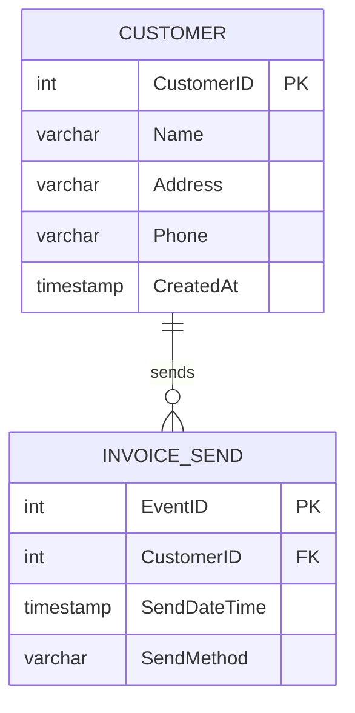

# Data Modeler Skill

このSkillは、ユースケース記述からRDBMSのテーブル設計を自動生成するエージェントです。
**ブラックボードパターン**を採用し、Claude自身が段階的にデータモデリングを実行します。

## アーキテクチャ概要

### ブラックボードパターン

このSkillは**ブラックボードパターン**を採用しています。ブラックボードとは、複数の専門知識（Knowledge Sources）が協調して問題を解決するための**共有データ空間**です。

```
┌─────────────────────────────────────────┐
│   Blackboard (共有データ空間)            │
│   /tmp/data-modeler-blackboard/        │
├─────────────────────────────────────────┤
│ ├── state.yaml                         │ ← フェーズ管理・制御情報
│ ├── entities_raw.json                  │ ← 抽出された名詞・動詞
│ ├── entities_classified.json          │ ← リソース/イベント分類結果
│ ├── model.json                         │ ← データモデル定義（関連含む）
│ ├── validation_result.json            │ ← 検証結果
│ └── er_diagram.mmd                     │ ← 最終出力（Mermaid ER図）
└─────────────────────────────────────────┘
           ↑              ↑
           │ 読み書き      │
           │              │
┌──────────┴──────────────┴──────────────┐
│  Claude (Control Component)            │
│  各フェーズを順次実行                   │
├────────────────────────────────────────┤
│ Phase 1: エンティティ抽出               │
│ Phase 2: リソース/イベント分類          │
│ Phase 3: 関連分析                       │
│ Phase 4: 検証                           │
│ Phase 5: ER図生成                       │
└────────────────────────────────────────┘
```

**ブラックボードの役割:**
- **中間結果の保存**: 各フェーズの成果物を保存
- **フェーズ間の連携**: 前フェーズの出力が次フェーズの入力になる
- **状態管理**: 現在のフェーズ、完了済みフェーズを記録
- **検証可能性**: 各段階の成果物を後から確認できる

## 使用方法

### 基本的な使い方

```bash
# ユースケースからデータモデルを生成
/data-modeler

請求期日が到来した場合、顧客に請求書を送付する。
期日までに入金がない場合には、確認状を送付する。
```

### ファイルからの入力

```bash
# タスク記述をファイルから読み込む
cat examples/invoice-management.txt
# その後、/data-modeler を実行してユースケースを入力
```

## 実行フロー

### 全体フロー

```
1. ブラックボード初期化
   ↓
2. Phase 1: エンティティ抽出
   ↓ (entities_raw.json をブラックボードに書き込み)
3. Phase 2: リソース/イベント分類
   ↓ (entities_classified.json をブラックボードに書き込み)
4. Phase 3: 関連分析
   ↓ (model.json をブラックボードに書き込み)
5. Phase 4: 検証
   ↓ (validation_result.json をブラックボードに書き込み)
6. Phase 5: ER図生成
   ↓ (er_diagram.mmd をブラックボードに書き込み)
7. 最終結果を表示
```

---

## Phase 1: エンティティ抽出

### 目的
ユースケース記述から、データモデリングに必要な**名詞（エンティティ候補）**と**動詞（イベント候補）**を抽出します。

### ブラックボードからの入力
- `state.yaml` の `input_usecase` フィールド（ユーザーが入力したユースケース記述）

### 処理内容

以下の基準でエンティティ候補を抽出してください：

**名詞の抽出:**
- 人、物、組織、概念を表す名詞
- データとして管理すべき対象
- 抽象的すぎる概念（「システム」「データ」「情報」など）は除外

**動詞の抽出:**
- 業務アクションを示す動詞
- 特定の時点で発生する行為
- 「〜する」「〜される」という形式

**命名規則:**
- 名詞: PascalCase、単数形（例: `Customer`, `Invoice`）
- 動詞: camelCase（例: `send`, `confirm`）
- 詳細は `templates/naming-rules.md` を参照

### ブラックボードへの出力

`entities_raw.json` に以下の形式で書き込み:

```json
{
  "noun_candidates": [
    {
      "japanese": "顧客",
      "english": "Customer",
      "note": "請求書を受け取る対象"
    },
    {
      "japanese": "請求書",
      "english": "Invoice",
      "note": "顧客に送付される文書"
    }
  ],
  "verb_candidates": [
    {
      "japanese": "送付する",
      "english": "send",
      "note": "請求書や確認状を送る行為"
    }
  ]
}
```

### 次フェーズへの遷移

`state.yaml` を更新:
```yaml
current_phase: classification
completed_phases:
  - entity_extraction
```

---

## Phase 2: リソース/イベント分類

### 目的
抽出されたエンティティ候補を、**リソース**と**イベント**に分類します。
これはイミュータブルデータモデルの基本原則です。

### ブラックボードからの入力
- `entities_raw.json`

### 処理内容

**分類基準:**

**リソース（Resource）:**
- 継続的に存在するもの
- 時間経過で状態が変化しうるもの
- 「〜がある」「〜を管理する」という表現で説明できる
- 例: 顧客、商品、社員、部署

**イベント（Event）:**
- 特定時点で発生した事実
- 一度発生したら変更されないもの（不変）
- 「〜した」「〜が発生した」という表現で説明できる
- **必ず1つの日時属性を持つ**（最重要）
- 例: 注文、入金、出荷、請求書送付

**イベント命名の推奨形式:**
- 動詞 + 名詞: `InvoiceSend`（請求書送付）、`PaymentMake`（入金）
- 詳細は `templates/naming-rules.md` を参照

**参考資料:**
- `templates/immutable-model-rules.md` の「エンティティの分類」セクション

### ブラックボードへの出力

`entities_classified.json` に以下の形式で書き込み:

```json
{
  "resources": [
    {
      "japanese": "顧客",
      "english": "Customer",
      "attributes": [
        {
          "japanese": "顧客ID",
          "english": "CustomerID",
          "type": "INT",
          "is_primary_key": true
        },
        {
          "japanese": "顧客名",
          "english": "Name",
          "type": "VARCHAR(100)",
          "is_primary_key": false
        }
      ],
      "note": "請求書を受け取る主体"
    }
  ],
  "events": [
    {
      "japanese": "請求書送付",
      "english": "InvoiceSend",
      "datetime_attribute": {
        "japanese": "送付日時",
        "english": "SendDateTime",
        "type": "TIMESTAMP"
      },
      "attributes": [
        {
          "japanese": "イベントID",
          "english": "EventID",
          "type": "INT",
          "is_primary_key": true
        },
        {
          "japanese": "送付日時",
          "english": "SendDateTime",
          "type": "TIMESTAMP",
          "is_primary_key": false
        },
        {
          "japanese": "送付方法",
          "english": "SendMethod",
          "type": "VARCHAR(50)",
          "is_primary_key": false
        }
      ],
      "note": "顧客に請求書を送付した事実"
    }
  ]
}
```

### 次フェーズへの遷移

`state.yaml` を更新:
```yaml
current_phase: relationship_analysis
completed_phases:
  - entity_extraction
  - classification
```

---

## Phase 3: 関連分析

### 目的
エンティティ間の関連（リレーションシップ）を分析し、カーディナリティと外部キーを決定します。
また、必要に応じて**交差エンティティ**を導入します。

### ブラックボードからの入力
- `entities_classified.json`

### 処理内容

**カーディナリティの決定:**

- **1:1（一対一）**: 例: 国 ←→ 首都
- **1:N（一対多）**: 例: 顧客 → 注文
- **M:N（多対多）**: **必ず交差エンティティで解消**

**交差エンティティの導入基準:**

以下のいずれかに該当する場合、交差エンティティを導入します：
- [ ] 多対多の関係である
- [ ] 関連に日時情報が必要
- [ ] 関連に数量・金額などの属性が必要
- [ ] 関連自体が業務上の意味を持つ

**例: 学生と講義（多対多）**
```
学生 ← 履修（交差エンティティ） → 講義

履修 {
  学生ID (FK)
  講義ID (FK)
  履修日時
  成績
}
```

**外部キーの決定:**
- 参照先のテーブルの主キー名をそのまま使用
- 例: `Customer.CustomerID` → `InvoiceSend.CustomerID`

**参考資料:**
- `templates/immutable-model-rules.md` の「交差エンティティの導入」セクション
- `templates/naming-rules.md` の「外部キー」セクション

### ブラックボードへの出力

`model.json` に以下の形式で書き込み:

```json
{
  "entities": [
    {
      "name": "Customer",
      "type": "resource",
      "attributes": [...]
    },
    {
      "name": "InvoiceSend",
      "type": "event",
      "attributes": [...]
    }
  ],
  "relationships": [
    {
      "from": "Customer",
      "to": "InvoiceSend",
      "cardinality": "1:N",
      "from_attribute": "CustomerID",
      "to_attribute": "CustomerID",
      "relationship_type": "sends"
    }
  ]
}
```

### 次フェーズへの遷移

`state.yaml` を更新:
```yaml
current_phase: validation
completed_phases:
  - entity_extraction
  - classification
  - relationship_analysis
```

---

## Phase 4: 検証

### 目的
作成したデータモデルが**イミュータブルデータモデルの原則**に準拠しているかを検証します。

### ブラックボードからの入力
- `model.json`

### 処理内容

以下のチェックリストで検証してください：

**イベントの検証:**
- [ ] すべてのイベントに1つだけ日時属性がある
- [ ] イベントに複数の日時属性がないか（ある場合はイベントを分割）
- [ ] イベント名が動詞+名詞の形式になっているか

**リソースの検証:**
- [ ] リソースに不要な日時属性がないか（更新日時など）
- [ ] 隠れたイベントが抽出されているか

**関連の検証:**
- [ ] 多対多の関係が交差エンティティで解消されているか
- [ ] 外部キー制約が適切に定義されているか

**命名規則の検証:**
- [ ] エンティティ名が単数形・PascalCaseか
- [ ] 主キーが `{エンティティ名}ID` 形式か
- [ ] 外部キーが参照先の主キー名と一致しているか

**参考資料:**
- `templates/immutable-model-rules.md` 全体
- `templates/naming-rules.md` 全体

### ブラックボードへの出力

`validation_result.json` に以下の形式で書き込み:

```json
{
  "is_valid": true,
  "errors": [],
  "warnings": [
    {
      "entity": "Customer",
      "message": "リソースに 'UpdatedAt' 属性があります。隠れたイベントがないか確認してください。"
    }
  ],
  "suggestions": [
    {
      "message": "InvoiceSend イベントと ConfirmationSend イベントを統合して SendDocument イベントにすることも検討できます。"
    }
  ]
}
```

### 次フェーズへの遷移

検証結果が `is_valid: true` の場合のみ次へ進む。
エラーがある場合は、該当フェーズに戻って修正。

`state.yaml` を更新:
```yaml
current_phase: diagram_generation
completed_phases:
  - entity_extraction
  - classification
  - relationship_analysis
  - validation
```

---

## Phase 5: ER図生成

### 目的
最終的なデータモデルを**Mermaid形式のER図**として出力します。

### ブラックボードからの入力
- `model.json`
- `validation_result.json`

### 処理内容

Mermaid ER図の形式で出力してください。

**カーディナリティ表記:**
- `||--o{`: 1対多（1 to many）
- `||--||`: 1対1（1 to 1）
- `}o--o{`: 多対多（交差エンティティ経由）

**属性表記:**
- `PK`: Primary Key
- `FK`: Foreign Key
- 型も記載（`int`, `varchar`, `timestamp` など）

### ブラックボードへの出力

`er_diagram.mmd` に以下の形式で書き込み:



### 最終出力

ユーザーに以下を表示:
1. ER図（Mermaidコード）
2. 検証結果のサマリー
3. ブラックボードのパス（必要に応じて確認できるように）

---

## イミュータブルデータモデルの原則

このSkillは以下の原則に基づいてモデリングを行います：

1. **エンティティの分類**
   - リソース: 時間経過で変化しうるもの（顧客、商品など）
   - イベント: 特定時点で発生した事実（注文、入金など）

2. **イベントの日時属性**
   - イベントエンティティには1つの日時属性のみ
   - 日時はUTC形式で管理

3. **隠れたイベントの抽出**
   - リソースに更新日時がある場合、イベントが隠されている可能性
   - 例: 社員情報の更新日時 → 社員異動イベント

4. **交差エンティティの導入**
   - 多対多の関係には交差エンティティを挿入
   - 関連自体が属性を持つ場合も導入

詳細は `templates/immutable-model-rules.md` を参照してください。

---

## 制御ロジック（Claudeの実行手順）

### ステップ1: ブラックボードの初期化

最初に以下を実行:

```bash
# ブラックボード領域を作成
mkdir -p /tmp/data-modeler-blackboard

# 状態ファイルを初期化
cat > /tmp/data-modeler-blackboard/state.yaml << 'EOF'
current_phase: entity_extraction
input_usecase: ""
completed_phases: []
EOF
```

### ステップ2: ユーザー入力の受け取り

ユーザーからのユースケース記述を `state.yaml` の `input_usecase` に保存。

### ステップ3: フェーズループ

`current_phase` を確認し、以下のフェーズを順次実行:

1. `entity_extraction` → Phase 1を実行
2. `classification` → Phase 2を実行
3. `relationship_analysis` → Phase 3を実行
4. `validation` → Phase 4を実行
5. `diagram_generation` → Phase 5を実行

各フェーズ完了後、`state.yaml` を更新して次フェーズへ。

### ステップ4: 最終結果の表示

`er_diagram.mmd` を読み取り、ユーザーに表示。

---

## トラブルシューティング

### エンティティ抽出が不十分な場合

- ユースケースに具体的な名詞・動詞を含めてください
- 業務の流れを時系列で記述してください

### イベントとリソースの分類が不適切な場合

- イベントには「〜した」「〜が発生した」という表現を使用
- リソースには「〜がある」「〜を管理する」という表現を使用

### 交差エンティティが不足する場合

- 多対多の関係を明示的に記述してください
- 例: 「学生は複数の講義を受講し、講義には複数の学生が参加する」

---

## カスタマイズ方法

### 命名規則の変更

`templates/naming-rules.md` を編集して、プロジェクト固有の命名規則を適用できます。

### モデリングルールの追加

`templates/immutable-model-rules.md` を編集して、追加のルールを定義できます。

---

## 参考資料

- [イミュータブルデータモデル - Scrapbox](https://scrapbox.io/kawasima/イミュータブルデータモデル)
- LangChainとLangGraphによるRAG・AIエージェント実践入門 第12章

---

## 制約事項

- 現バージョンは日本語ユースケースのみ対応
- ER図はMermaid形式のみ出力
- DDL生成は今後のバージョンで対応予定
