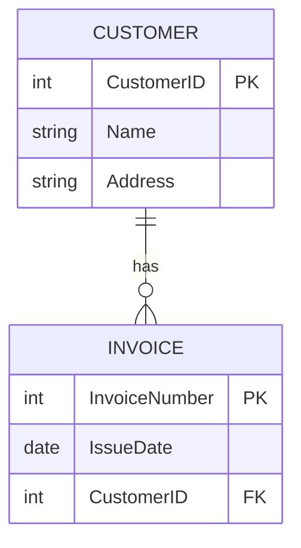

# Data Modeler Skill

このSkillは、ユースケース記述からRDBMSのテーブル設計を自動生成するエージェントです。
ブラックボードパターンを採用し、複数の知識源（Knowledge Sources）が協調してデータモデリングを実行します。

## アーキテクチャ概要

```
Blackboard (共有データ空間)
├── state.yaml - フェーズ管理
├── entities.json - 抽出されたエンティティ
├── model.json - データモデル定義
└── validation_result.json - 検証結果

Knowledge Sources (専門知識モジュール)
├── entity-extractor - エンティティ抽出
├── classifier - リソース/イベント分類
├── relationship-analyzer - 関連分析
└── diagram-generator - ER図生成

Control Component (このファイル)
└── 状態に応じて適切なKnowledge Sourceを呼び出す
```

## 使用方法

### 基本的な使い方

```bash
# ユースケースからデータモデルを生成
claude code --skill data-modeler "以下のユースケースに対してテーブル設計を行ってください：

請求期日が到来した場合、顧客に請求書を送付する。
期日までに入金がない場合には、確認状を送付する。"
```

### ファイルからの入力

```bash
# タスク記述をファイルから読み込む
claude code --skill data-modeler "$(cat usecase.txt)"
```

## 実行フロー

1. **初期化**: ブラックボード領域を作成
2. **エンティティ抽出**: ユースケースから名詞・動詞を抽出
3. **分類**: リソースとイベントに分類
4. **関連分析**: カーディナリティと交差エンティティの検討
5. **検証**: イミュータブルモデルルールに準拠しているか確認
6. **ER図生成**: Mermaid形式でER図を出力

## イミュータブルデータモデルの原則

このSkillは以下の原則に基づいてモデリングを行います：

1. **エンティティの分類**
   - リソース: 時間経過で変化しうるもの（顧客、商品など）
   - イベント: 特定時点で発生した事実（注文、入金など）

2. **イベントの日時属性**
   - イベントエンティティには1つの日時属性のみ
   - 日時はUTC形式で管理

3. **隠れたイベントの抽出**
   - リソースに更新日時がある場合、イベントが隠されている可能性
   - 例: 社員情報の更新日時 → 社員異動イベント

4. **交差エンティティの導入**
   - 多対多の関係には交差エンティティを挿入
   - 依存度が強すぎる場合に導入

## 制御ロジック

Claude Codeがこのスキルを実行する際の制御フローは以下の通りです：

### 1. 状態の初期化・確認

```python
# ブラックボードの状態をチェック
if not exists("/tmp/data-modeler-blackboard/state.yaml"):
    initialize_blackboard()
```

### 2. フェーズに応じたKnowledge Source呼び出し

現在の状態を確認し、次に実行すべきKnowledge Sourceを決定します。

```yaml
# state.yaml の構造
current_phase: entity_extraction  # または: classification, relationship_analysis, validation, diagram_generation
input_usecase: "ユースケース記述"
completed_phases: []
next_action: entity-extractor
```

### 3. Knowledge Sourceの実行

各フェーズで対応するスクリプトを実行し、結果をブラックボードに書き込みます。

## Claude Codeでの実装ガイド

### ステップ1: 初期化

```bash
# ブラックボード領域を作成
mkdir -p /tmp/data-modeler-blackboard

# 状態ファイルを初期化
cat > /tmp/data-modeler-blackboard/state.yaml << 'EOF'
current_phase: entity_extraction
input_usecase: ""
completed_phases: []
next_action: entity-extractor
EOF
```

### ステップ2: ユースケースの受け取り

ユーザーからのユースケース記述を`state.yaml`に記録します。

### ステップ3: エンティティ抽出の実行

`knowledge-sources/entity-extractor/extract.py`を呼び出してエンティティを抽出します。

### ステップ4: 段階的な処理

各Knowledge Sourceを順次実行し、最終的にER図を生成します。

## 出力形式

### entities.json

```json
{
  "resources": [
    {
      "name": "顧客",
      "english_name": "Customer",
      "attributes": ["顧客ID", "顧客名", "住所", "電話番号"]
    }
  ],
  "events": [
    {
      "name": "請求書送付",
      "english_name": "InvoiceSend",
      "datetime_attribute": "送付日時",
      "attributes": ["請求書番号", "送付日時", "送付方法"]
    }
  ]
}
```

### model.json

```json
{
  "entities": [...],
  "relationships": [
    {
      "from": "Customer",
      "to": "Invoice",
      "cardinality": "1:N",
      "type": "has"
    }
  ]
}
```

### 最終出力: Mermaid ER図



## トラブルシューティング

### エンティティ抽出が不十分な場合

- ユースケースに具体的な名詞・動詞を含めてください
- 業務の流れを時系列で記述してください

### イベントとリソースの分類が不適切な場合

- イベントには「〜した」「〜が発生した」という表現を使用
- リソースには「〜がある」「〜を管理する」という表現を使用

### 交差エンティティが不足する場合

- 多対多の関係を明示的に記述してください
- 例: 「学生は複数の講義を受講し、講義には複数の学生が参加する」

## カスタマイズ方法

### 命名規則の変更

`templates/naming-rules.yaml`を編集して、プロジェクト固有の命名規則を適用できます。

### モデリングルールの追加

`templates/immutable-model-rules.md`を編集して、追加のルールを定義できます。

## 参考資料

- [イミュータブルデータモデル - Scrapbox](https://scrapbox.io/kawasima/イミュータブルデータモデル)
- LangChainとLangGraphによるRAG・AIエージェント実践入門 第12章

## 制約事項

- 現バージョンは日本語ユースケースのみ対応
- ER図はMermaid形式のみ出力
- DDL生成は今後のバージョンで対応予定
