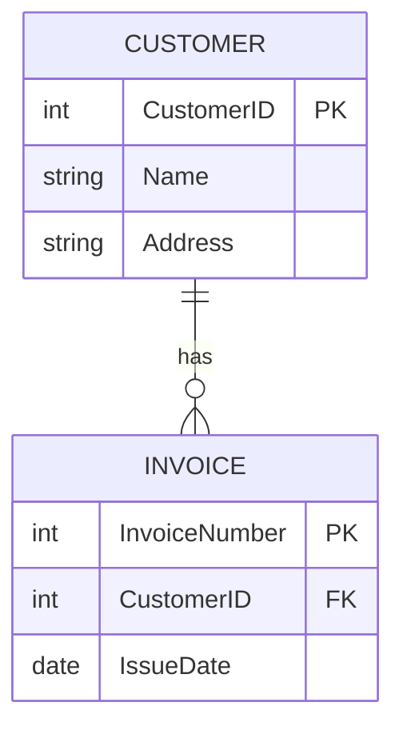
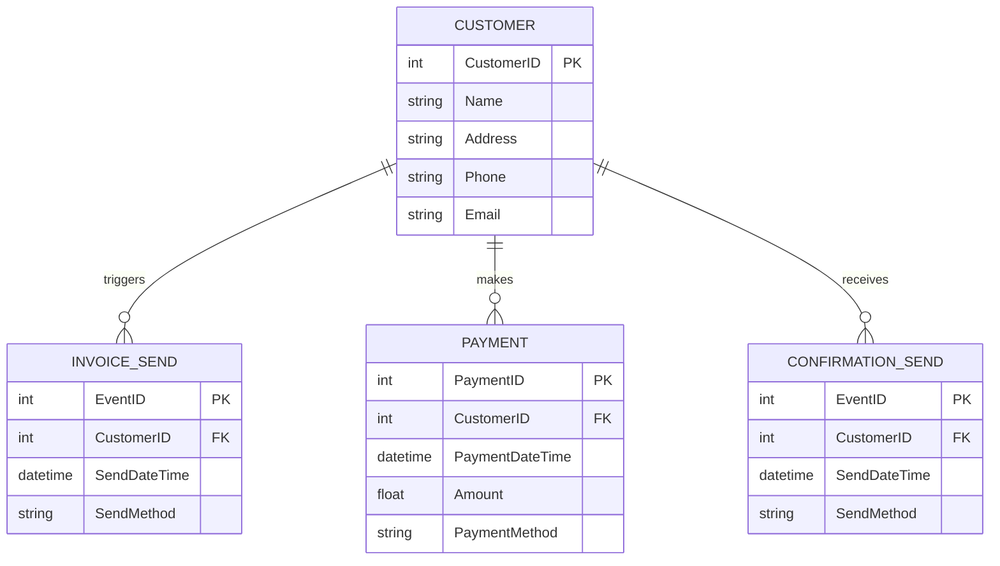

# Diagram Generator Knowledge Source

データモデル定義からMermaid形式のER図を生成します。

## 処理内容

1. エンティティ定義の読み込み
2. 関連の読み込み
3. Mermaid ER図記法への変換
4. 図の生成と検証

## Mermaid ER図の記法

### 基本構造



### カーディナリティの表記

| 記法 | 意味 |
|------|------|
| `||--||` | 1対1 (exactly one) |
| `||--o{` | 1対多 (one to many) |
| `}o--o{` | 多対多 (many to many) |
| `||--o|` | 1対0または1 |

### 属性の型

- `int` - 整数
- `string` - 文字列
- `date` - 日付
- `datetime` - 日時
- `float` - 浮動小数点数
- `boolean` - 真偽値

### 制約の表記

- `PK` - Primary Key（主キー）
- `FK` - Foreign Key（外部キー）
- `UK` - Unique Key（一意キー）

## 入力

- `/tmp/data-modeler-blackboard/model.json`

## 出力

- `/tmp/data-modeler-blackboard/diagram.mmd` - Mermaid形式のER図
- `/tmp/data-modeler-blackboard/diagram.png` - PNG画像（オプション）

## 生成ルール

### エンティティ名

- 英語名を使用（PascalCase）
- 複数形ではなく単数形
- 大文字スネークケース（例: `CUSTOMER`, `INVOICE_SEND`）

### 属性名

- 英語名を使用（PascalCase）
- 主キーは`{エンティティ名}ID`の形式

### 関連の表現

イベントとリソースの関連は、動詞で表現します。

**例:**
- `CUSTOMER ||--o{ INVOICE_SEND : triggers`
- `CUSTOMER ||--o{ PAYMENT : makes`

## 実装例

```python
def generate_mermaid_diagram(model: dict) -> str:
    """
    データモデルからMermaid ER図を生成
    """
    
    lines = ["erDiagram"]
    
    # 関連を追加
    for rel in model['relationships']:
        from_entity = rel['from_entity'].upper()
        to_entity = rel['to_entity'].upper()
        rel_type = rel['relationship_type']
        cardinality = rel['cardinality']
        
        # カーディナリティを記法に変換
        card_notation = convert_cardinality(cardinality)
        
        lines.append(f"    {from_entity} {card_notation} {to_entity} : {rel_type}")
    
    # エンティティ定義を追加
    for resource in model['entities']['resources']:
        entity_name = resource['english'].upper()
        lines.append(f"    {entity_name} {{")
        
        # 主キー
        lines.append(f"        int {resource['english']}ID PK")
        
        # 属性
        for attr in resource['attributes']:
            attr_type = infer_type(attr)
            lines.append(f"        {attr_type} {attr}")
        
        lines.append("    }")
    
    return "\n".join(lines)
```

## 検証項目

- [ ] すべてのエンティティが定義されている
- [ ] すべての関連が表現されている
- [ ] 主キーが定義されている
- [ ] 外部キーが適切に設定されている
- [ ] Mermaid記法として正しい

## 出力例



## PNG画像の生成（オプション）

Mermaid CLIを使用してPNG画像を生成できます。

```bash
# Mermaid CLIのインストール
npm install -g @mermaid-js/mermaid-cli

# PNG生成
mmdc -i diagram.mmd -o diagram.png
```
