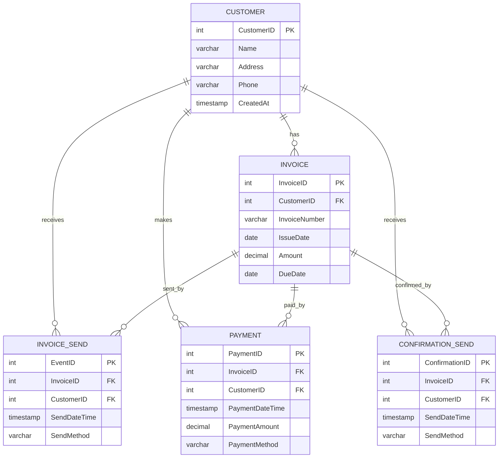

# Data Modeling Result Summary

## 実行情報

- **実行日時:** 2026-01-10
- **スキル:** data-modeler v2.0.0
- **パターン:** ブラックボード（5フェーズ完了）

## ユースケース

```
請求期日が到来した場合、顧客に請求書を送付する。
期日までに入金がない場合には、確認状を送付する。

追加要件:
- 顧客は複数の請求書を受け取ることができる
- 請求書には請求番号、発行日、請求金額、支払期日が含まれる
- 入金には入金日、入金額、入金方法が記録される
- 確認状の送付履歴も保持する
- すべてのイベント（請求書送付、入金、確認状送付）には日時を記録する
```

---

## 生成結果

### エンティティ構成

**リソース（2個）:**
- `Customer`（顧客） - 請求書を受け取る主体
- `Invoice`（請求書） - 発行された請求文書

**イベント（3個）:**
- `InvoiceSend`（請求書送付） - SendDateTime
- `Payment`（入金） - PaymentDateTime
- `ConfirmationSend`（確認状送付） - SendDateTime

### リレーションシップ

全て1:N（一対多）の関係:
- Customer → Invoice, InvoiceSend, Payment, ConfirmationSend
- Invoice → InvoiceSend, Payment, ConfirmationSend

---

## 検証結果

✅ **合格（is_valid: true）**

- イベントの日時属性: 各イベント1つのみ ✓
- リソースの日時属性: 適切 ✓
- 多対多の解消: 該当なし ✓
- 命名規則: PascalCase・単数形 ✓

---

## 成果物ファイル

| ファイル | 内容 |
|---------|------|
| `entities_raw.json` | 抽出された名詞・動詞候補 |
| `entities_classified.json` | リソース/イベント分類結果 |
| `model.json` | データモデル定義 |
| `validation_result.json` | 検証結果詳細 |
| `er_diagram.mmd` | Mermaid ER図 |
| `state.yaml` | フェーズ管理情報 |

---

## ER図プレビュー


